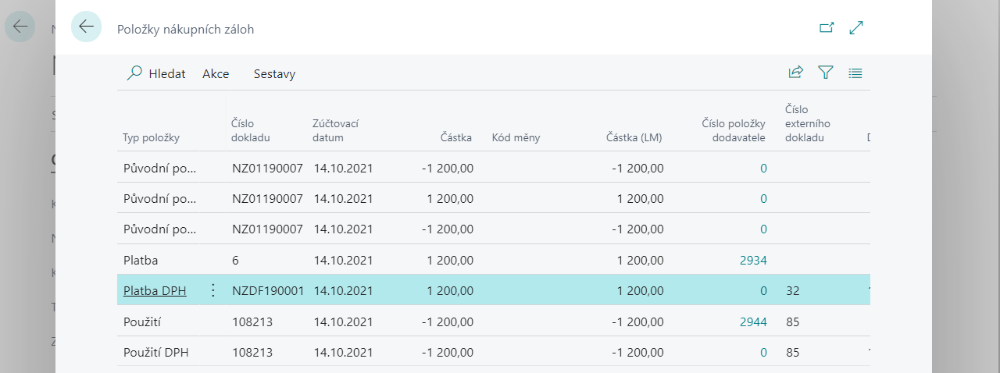
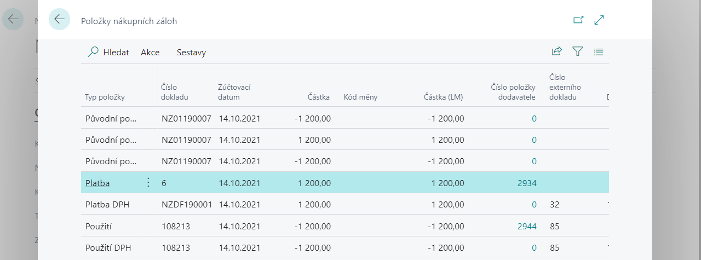

# Doplňkové funkce (opravy)

Aplikace Zálohové platby kromě základní funkčnosti, jako je vytvoření, úhrada a použití zálohy, umožňuje i některé doplňkové funkce pro usnadnění práce se zálohovými doklady. Těmito doplňkovými funkcemi jsou např.:
- Storno zálohového daňového dokladu
- Odpojení chybné platby od zálohy
- Dodatečné připojení platby k záloze
- Odpojení zálohy od zaúčtované faktury
- Připojení zálohy do zaúčtované faktury

## Storno zálohového daňového dokladu

Funkci pro storno zálohového daňového dokladu využijete např. v situaci, kdy k úhradě nákupní zálohy proúčtujete chybně zálohový daňový doklad a potřebujete tento doklad odúčtovat.

Pro storno zálohového daňového dokladu postupujte následujícím způsobem:

1. Vyberte ikonu , zadejte **Nákupní zálohové faktury** a poté vyberte související odkaz.
2. V přehledu vyhledejte nákupní zálohovou fakturu, která je zaplacená a je k ní proúčtován daňový doklad. Použijte funkci **Položky zálohy.**
3. Otevře se Vám přehled položek nákupních faktur, kde umístěte kurzor na řádek s **Typem položky - Platba DPH**
 
4. V pásu akcí zvolte **Účtovat daňový dobropis**.
5. Do zobrazené stránky se předvyplní všechny údaje z položky **Platba DPH**. Údaje zkontrolujte a potvrďte tlačítkem **OK**.
6. Do položek záloh se vytvoří nová položka s **Typem položky Platba DPH** s opačným znaménkem. Položka má rovněž odraz v účetnictví (věcné položky) a v položce DPH.

Pokud chcete nyní proúčtovat znovu daňový doklad k záloze, umístěte kurzor na řádek s **Typem položky Platba** a zvolte akci **Účtovat daňový doklad**.

## Odpojení chybné platby od zálohy

Pokud jste k záloze připojili chybnou platbu, je možné ji od zálohy odpojit. Funkce je dostupná z položek zálohy pod funkcí **Odpojit platbu zálohy**. Odpojení je možné pouze v případě, že platba zálohy ještě nebyla čerpána do žádného koncového dokladu. 

### Odpojení platby od zálohy
Pro ddpojení platby od zálohy postupujte následujícím způsobem:

1. Vyberte ikonu , zadejte **Nákupní zálohové faktury** a poté vyberte související odkaz.
2. V přehledu vyhledejte nákupní zálohovou fakturu, která je zaplacená.
3. Zvolte funkci **Položky zálohy**.
4. Kurzor umístěte na řádek s **Typem položky - Platba**.  
 
5. Zvolte akci **Odpojit platbu zálohy**.
6. Do položek záloh se vytvoří nová položka s **Typem položky - Platba** s opačným znaménkem. Pokud k platbě existoval i daňový doklad (řádek s **Typem položky Platba DPH**), vznikne automaticky i zálohový doklad s opačným znaménkem, a tedy opačná položka **Platba DPH.**
7. Položka má rovněž odraz v účetnictví (věcné položky) a v položce DPH. Vznikají nové položky dodavatele, resp. zákazníka pro přeúčtování položky z účtu záloh na standardní účet salda.

### Odpojení platby od zálohy z položek
Pro odpojení platby od zálohy z položek dodavatele, resp. zákazníka postupujte následujícím způsobem:

Odpojit chybnou platbu od zálohy je možné rovněž z položek dodavatele, resp. zákazníka. Z položky zákazníka, která má **Typ dokladu Platba** a vyplněné pole **Číslo zálohy**, je možné pomocí funkce **Odpojit zálohovou fakturu** provést odpojení platby od zálohy.

1. Vyhledejte položku dodavatele, resp. zákazníka, kterou byla uhrazena zálohová faktura.
2. Zvolte akci **Odpojit zálohovou fakturu**.
3. Do položek záloh se vytvoří nová položka s **Typem položky - Platba** s opačným znaménkem. Pokud k platbě existoval i daňový doklad (řádek s **Typem položky - Platba DPH**), vznikne automaticky i zálohový doklad s opačným znaménkem, a tedy opačná položka **Platba DPH**.
4. Položka má rovněž odraz v účetnictví (věcné položky) a v položce DPH. Vznikají nové položky dodavatele, resp. zákazníka pro přeúčtování položky z účtu záloh na standardní účet salda.

## Dodatečné připojení platby k záloze

Pokud je do salda dodavatele, resp. zákazníka zaúčtována platba, která nebyla při účtování připojena k záloze, je možné ji připojit k záloze dodatečně. Funkce je dostupná z položek dodavatele, resp. zákazníka.

Dodatečné připojení platby k záloze:

1. Vyhledejte otevřenou položku dodavatele, resp. zákazníka, která má **Typ dokladu = Platba**.
2. Zvolte akci **Propojit zálohovou fakturu**
3. Na otevřené stránce zvolte *Nový*.
4. Z pole **Číslo zálohy** pomocí asistenčního tlačítka zobrazte přehled dostupných záloh
5. Umístěte kurzor na řádek se zálohou, kterou chcete k platbě připojit a potvrďte tlačítkem **OK**
6. Stránku s propojením zálohy rovněž potvrďte tlačítkem **OK**.
7. Platba se propojila se zálohou. Vznikla položka zálohy s **Typem položky - Platba**, příp. i **Platba DPH**. Položka má rovněž odraz v účetnictví (věcné položky), příp. v položce DPH. Vznikly nové položky dodavatele, resp. zákazníka pro přeúčtování položky z účtu salda na účet záloh.

## Odpojení zálohy od zaúčtované faktury

V případě chybného propojení faktury a zálohy je možné tyto doklady od sebe dodatečně odpojit. 

Funkce má některá omezení:
- Pokud je k zaúčtované faktuře připojeno více záloh, je třeba odpojit vždy všechny zálohy současně, tzn. není možné ponechat jednu zálohu připojenou a ostatní odpojit.
- Rozpojení je provedeno vždy se stejným zúčtovacím datem a datem DPH, jako byl proúčtován původní doklad. 
- Pokud bude účetní období již uzavřeno nebo pro uživatele omezeno, není možné storno provést.

Pro odpojení zálohy od zaúčtované faktury postupujte následujícím způsobem:

1. Vyhledejte zaúčtovanou fakturu, ke které je připojena záloha.
2. Nad danou fakturou zvolte akci **Zrušit použití zálohové faktury**.
3. Potvrďte dialogové okno.
4. Provede se odúčtování zálohy od faktury. V položkách zálohy vzniknou opačné položky, které mají **Typ dokladu = Použití**, příp. Použití DPH. Položky mají rovněž odraz v účetnictví (věcné položky), příp. v položce DPH. Vznikly nové položky dodavatele, resp. zákazníka pro přeúčtování položky mezi účtem salda a účtem záloh.

## Připojení zálohy do zaúčtované faktury

Pokud bylo při účtování prodejní nebo nákupní faktury opomenuto přiřazení zálohy, je možné zálohu do dokladu dodatečně připojit. Funkce je dostupná ze zaúčtované prodejní faktury pomocí akce **Použít zálohovou fakturu**. 

Funkce má některá omezení:
- Pro účtování vyrovnání faktury a zálohy je použito původní zúčtovací datum a datum DPH jako v původní zaúčtované faktuře. 
- Před zaúčtováním není možné spustit náhled účtování
- Připojovaná částka zálohy musí mít maximálně hodnotu zůstatku zaúčtované faktury, resp. položky zákazníka s typem Faktura, pokud např. došlo k částečné úhradě faktury jiným způsobem. Při dodatečném propojování zálohy a faktury systém automaticky nesnižuje částku čerpané zálohy, je třeba ji upravit uživatelem. 

Pro připojení zálohy do zaúčtované faktury postupujte následujícím způsobem:

1. Vyhledejte zaúčtovanou fakturu, ke které není připojena záloha.
2. Nad touto fakturou požijte funkci **Použít zálohovou fakturu**.
3. Na otevřené stránce zvolte **Nový**.
4. Z pole **Číslo zálohy** pomocí asistenčního tlačítka zobrazte přehled dostupných záloh.
5. Umístěte kurzor na řádek se zálohou, kterou chcete k platbě připojit a potvrďte tlačítkem **OK**.
6. Pokud chcete k faktuře připojit další zálohy, postup opakujte.
7. Upravte hodnotu v poli **Částka** tak, aby odpovídala maximální hodnotě zůstatku faktury.
8. Stránku s propojením zálohy potvrďte tlačítkem **OK**.
9. Záloha se propojila s fakturou. V položkách zálohy vznikly položky, které mají **Typ dokladu = Použití**, příp. **Použití DPH**. Položky mají odraz v účetnictví (věcné položky), příp. v položce DPH. Vznikly nové položky dodavatele, resp. zákazníka pro přeúčtování položky mezi účtem salda a účtem záloh.

## Viz také

[Zálohové platby pro Česko (rozšíření)](ui-extensions-advance-payments-localization-cz.md)  
[České lokální funkcionality](czech-local-functionality.md)  
[Finance](../../finance.md)
