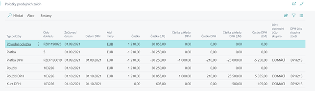
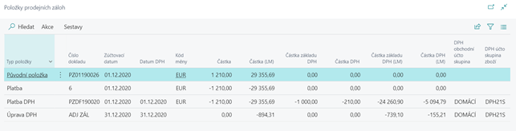

# Zálohy v cizí měně  

Aplikace Zálohové platby pracuje s cizími měnami. Je třeba ale dodržet pravidlo zachování jednotné měny v celém životním cyklu zálohy, tzn. záloha, úhrada, faktura, uzavření - vše musí být účtováno v jedné měně.

- Položky zálohy jsou vždy evidovány v cizí i lokální měně.
- Pokud máte pro prodejní zálohu nastaveno automatické vytvoření zálohového daňového dokladu, proúčtuje se DPH automaticky ve směnném kurzu použitém při úhradě zálohy. Při ručním vytvoření daňového dokladu v nákupní záloze se automaticky do dialogového okna připraví směnný kurz úhrady zálohy
- Při rozdílném směnném kurzu mezi úhradou a konečnou fakturou vzniká v položkách zálohy nová položka s typem Kurz DPH pro dorovnání celkové částky zálohy, základu a částky DPH v lokální měně.

## Úhrada zálohy v cizí měně
1. Vyberte ikonu , zadejte **Prodejní zálohové faktury** a poté vyberte související odkaz.
2.	Vytvořte novou prodejní zálohovou fakturu na libovolného zákazníka. 
3.	Do pole **Kód měny** na záložce **Detaily faktury** zvolte např. EUR. 
4.	Zadejte v řádku zálohy **DPH účto skupinu zboží** a **Částku včetně DPH**.
5.	Zálohu vydejte pomocí funkce **Vydat** z pásu akcí.
6.	Vyhledejte a otevřete libovolný **Finanční deník**.
7.	V řádku finančního deníku vyplňte pole **Typ dokladu = platba**, zadejte příslušné číslo zákazníka. 
8.	V poli **Kód měny** zvolte EUR a nastavte směnný kurz
9.	V poli **Číslo zálohy** vyberte číslo zálohové faktury vytvořené v předchozích bodech.
10.	Doplňte protikonto a deník zaúčtujte.
11.	V položkách zálohy vznikla položka s **Typem položky = Platba**.

## Propojení zálohy s fakturou
1. Vyberte ikonu , zadejte **Prodejní zálohové faktury** a poté vyberte související odkaz.
2. Vytvořte novou prodejní fakturu v EUR na stejného zákazníka, zadejte směnný kurz a řádky faktury.
3. V pásu akcí zvolte **Propojit zálohovou** fakturu a propojte fakturu se zálohou (viz kapitola *Použití zálohové faktury v konečné faktuře*). 
4. Fakturu zaúčtujte.
5. Při rozdílném směnném kurzu mezi úhradou a konečnou fakturou vzniká v položkách zálohy nová položka s typem **Kurz DPH** pro dorovnání celkové částky zálohy v CZK a dorovnání základu a částky DPH v CZK.

## Přepočet záloh na konci roku

Saldo zákazníků v cizí měně je na konci roku potřeba přepočítat kurzem vyhlášeným ČNB. Standardní funkce pro **Úpravu směnných kurzů** přepočítává pouze položky zákazníků a dodavatelů, vytváří k nim detailní položky pro úpravu původně účtované hodnoty. Přepočítají se tak i položky úhrady záloh. Samotné zálohové faktury tato standardní funkce ale neovlivní.

Pokud chcete promítnout výsledky úpravy směnných kurzů i do položek záloh (přepočítat DPH v lokální měně na zálohách), je třeba spustit následný report pro úpravu položek záloh - **Upravit směnné kurzy záloh** **(Adjust Advance Letter Exchange Rates)**. Tato funkce vyhledá všechny detailní položky zákazníka s typem položky = Nerealizovaný zisk, resp. Nerealizovaná ztráta účtované ve zvolený den (např. 31.12.) a převede je do položek záloh s typem Úprava DPH. Upraví tak celkovou částku zálohy v lokální měně a částky základu a DPH v lokální měně. Účtování proběhne mezi účtem pro **základ zálohy (Nastavení účtování DPH)** a standardním účtem pro kurzové rozdíly.

Adjustace záloh bude provedena i zpětně, tzn. např. kdy je záloha vystavena a uhrazena v roce 2020 a v lednu 2021 je čerpána fakturou. Pokud je provedena adjustace až po tomto účtování, provede adjustace korekci zálohy zpětně k 31.12.20 a tuto korekci následně odúčtuje k datu vystavení faktury.

Funkci pro přepočet záloh na konci roku není nutné používat. Pokud nebude použita, použije se při účtování konečné faktury DPH (v lokální měně), které bylo proúčtováno při úhradě zálohy.
Pokud budou existovat položky **Úprava DPH**, budou následně využívány i při účtování koncových faktur připojených k záloze.

## Viz také

[Zálohové platby pro Česko (rozšíření)](ui-extensions-advance-payments-localization-cz.md)  
[České lokální funkcionality](czech-local-functionality.md)  
[Finance](../../finance.md)
