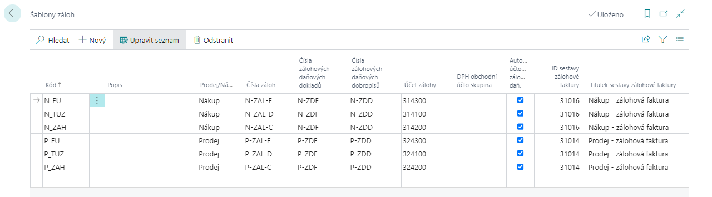
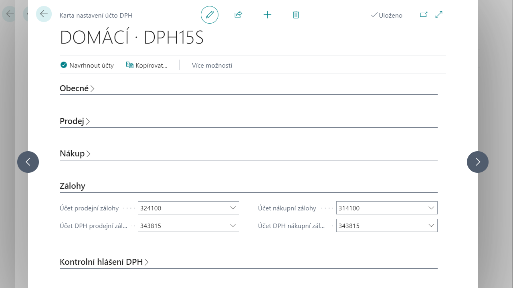

# Nastavení zálohových plateb

Pro práci s aplikací Zálohových plateb je třeba provést nastavení číselných řad, tiskových sestav, účtů pro účtování. 

## Šablony záloh

(Advance Letter Templates) jsou základním nastavením aplikace. Slouží pro členění záloh do skupin a obsahují výchozí nastavení pro zálohové faktury, které se z šablon tvoří. 

Pro nastavení šablony záloh postupujte následujícím způsobem:
1. Vyberte ikonu , zadejte **Šablony záloh** a poté vyberte související odkaz.
2. Pro nastavení šablony je potřeba vyplnit následující pole:
    - **Kód (Code)** - každá šablona má svůj jedinečný kód definovaný pro oblast prodeje nebo nákupu. Je možné vytvořit a používat libovolné množství šablon záloh, nejméně však jednu pro každou oblast
    - **Popis (Description)** - bližší popis šablony zálohy
    - **Prodej/nákup (Sales/Purchase)** - definuje, zda je šablona určena pro oblast prodeje nebo nákupu
    - **Čísla záloh (Advance Letter Document Nos.)** - číselná řada pro zálohové faktury
    - **Čísla zálohových daňových dokladů (Advance Letter Invoice Nos.)** - číselná řada pro zálohové daňové doklady
    - **Čísla zálohových daňových dobropisů (Advance Letter Cr. Memo Nos).**- číselná řada pro zálohové daňové dobropisy
    - **Účet zálohy (Advance Letter G/L Account)** - účet pro evidenci úhrad záloh (saldo záloh)
    - **DPH obchodní účto skupina (VAT Bus. Posting Group)** - přednastavení DPH obchodní účtoskupiny pro danou šablonu záloh. Pokud je pole prázdné, do zálohy se použije DPH obchodní účto skupina ze zákazníka/dodavatele, pokud je pro danou šablonu nastavené, použije se ze šablony.
    - **Automatické účtování zálohového daňového dokladu (Automatic Post VAT Document )** - určuje, zda má být při použití zálohy v konečné faktuře provedeno automatické oddanění zálohy, či zda bude uživatel oddanění provádět ručně. Na straně prodeje navíc ovlivňuje automatické vytvoření daňového dokladu k platbě zálohy (na straně nákupu je vždy daňový doklad k platbě zálohy účtován uživatelem ručně). V jednotlivých dokladech je možné hodnotu v poli změnit.
    - **ID sestavy zálohové faktury (Document Report ID)** - specifikuje číslo reportu pro tisk zálohové faktury (standardní tisk nákupní zálohy R 31016, prodejní zálohy R 31014)
    - **ID sestavy faktury/dobropisu (Invoice/Cr. Memo Report ID)** - specifikuje číslo reportu pro tisk zálohového daňového dokladu, resp. dobropisu (standardní tisk nákupního daňového dokladu R 31017, prodejního daňového dokladu R 31015)
3. Po vyplnění řádku šablony přehled můžete zavřít.

## Nastavení účtování DPH

Pro každou kombinaci DPH účto skupin vyžadující účtování daňového dokladu k zálohové faktuře je potřeba nastavit příslušná pole v **Nastavení účtování DPH** na záložce **Zálohy (Advance CZZ)**. 

Pro nastavení účtování DPH zálohových plateb postupujte následujícím způsobem:
1. Vyberte ikonu , zadejte **Nastavení účtování DPH** a poté vyberte související odkaz.
2. Na přehledu vyberte kombinaci účtoskupin, kterou chcete upravit a klikněte na tlačítko **Úpravy**.
3. Na kartě nastavšní účto DPH v záložce **Zálohy** vyberte pole vyplňte čísla účtu dle potřeby.
    - Účet prodejní zálohy, resp. Účet nákupní zálohy (Sales/Purchase Advance Letter Account)
    - Účet DPH prodejní zálohy, resp. Účet DPH nákupní zálohy (Sales/Purchase Advance Letter VAT Account)

    Mezi těmito dvěma účty bude probíhat účtování daňových dokladů či dobropisů k záloze. **Účet prodejní/nákupní zálohy (Sales/Purchase Advance Letter Account)** může, ale nemusí být nastavený stejně jako **Účet zálohy (Advance Letter G/L Account)** v Šablonách záloh (účty salda), **Účet DPH prodejní/nákupní zálohy (Sales/Purchase Advance Letter VAT Account)** slouží pro evidenci částek DPH ze záloh.
4. Po nastavení můžete kartu a přehled zavřít.

## Výběry sestav pro nákup a prodej

Tiskové sestavy vztahující se k zálohám (zálohové faktury, daňové doklady a dobropisy) se nastavují v **Šablonách záloh**.

### Výběr sestav pro nákup
Pro nastavení tiskových sestav pro nákupní zálohové fakury postupujte následujícím způsobem:
1. Vyberte ikonu , zadejte **Výběr sestav - Nákup** a poté vyberte související odkaz.
2. V přehledu vyberte použití **Faktura** a v řádcích vyberte v poli **ID sestavy** - **31028 Nákup – faktura se zálohou**.
3. Po nastavení můžete přehled zavřít.

### Výběr sestav pro prodej
Pro nastavení tiskových sestav pro prodejní zálohové fakury postupujte následujícím způsobem:
1. Vyberte ikonu , zadejte **Výběr sestav - Prodej** a poté vyberte související odkaz.
2. V přehledu vyberte použití **Faktura** a v řádcích vyberte v poli **ID sestavy** - **31189 Prodejní fatura**.
3. Po nastavení můžete přehled zavřít.

## Nastavení výkazu DPH

Při účtování položek DPH ze záloh jsou použita standardní pole "základ" a "částka". Proto jsou i ve výkazu DPH použity v poli **Typ částky** využity pouze standardní volby "základ" a "částka". Položky DPH účtované ze zálohy jsou tak automaticky součástí výkazu DPH, není třeba pro ně v rámci výkazu DPH připravovat samostatné řádky.

## Viz také

[Zálohové platby pro Česko (rozšíření)](ui-extensions-advance-payments-localization-cz.md)  
[České lokální funkcionality](czech-local-functionality.md)  
[Finance](../../finance.md)
