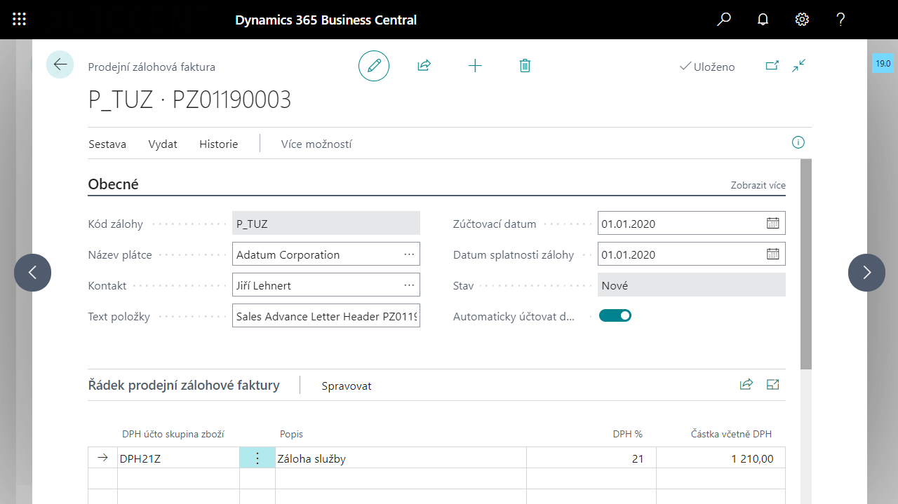

# Porozumění základním principům aplikace Zálohových plateb a životní cyklus zálohy

## Základní principy aplikace Zálohové platby

 - Párování dokladů na úrovni hlaviček dokladů - hlavička faktury párována na hlavičku zálohy.
 - Pro účtování úhrady zálohy je využíván **Účet zálohy** z **Šablony zálohy**.
 - Všechny položky zálohy jsou dostupné v **Historii zálohy** na jedné stránce.
 - Většina akcí, které je možné v rámci zálohy provádět, je spuštěna z příslušných položek v **Historii zálohy**, např. z položky typu **Platba** je možné spustit funkci **Účtovat zálohový daňový doklad**, příp. **Odpojit platbu záloh**y, z položky typu **Platba DPH** je možné spustit funkci **Účtovat daňový dobropis** (pro zaúčtování storna) a vytisknout **Zálohový daňový doklad**.
 - Při účtování zálohových daňových dokladů či dobropisů nevznikají samostatné hlavičkové doklady, vznikají pouze položky zálohy, ze kterých je daňové doklady možné vytisknout.
 - Ve finančním deníku (pokladním dokladu) je k úhradě záloh potřeba nastavit pouze **Typ dokladu** s hodnotou Platba a položku napojit na zálohu prostřednictvím pole **Číslo zálohy**.
 - V položce zákazníka/dodavatele jsou dostupná nová pole **Číslo zálohy** a **Kód šablony zálohy**, v položce DPH pole **Číslo zálohy**.
 - V položce DPH jsou zálohy účtovány s typem výpočtu DPH = **normální DPH** a je použito standardní pole **Základ** pro účtování základu zálohy.
 
## Životní cyklus prodejní zálohy

Celý životní cyklus zálohy je dostupný na jednom místě, kartě prodejní nebo nákupní zálohové faktury. Zde jsou evidovány všechny historické položky spojené se zálohou a dostupné funkce pro tvorbu daňových dokladů či dobropisů, uzavírání zálohy, tiskové sestavy a další.

Aktuální fáze založení, úhrady či čerpání zálohy se odráží v poli **Stav**.

1.	Při založení zálohy má záloha stav **Nové**.
2.	Vydáním zálohy se mění její stav na **K úhradě**, vzniká úvodní inicializační položka **Původní položka**, záloha je připravena k úhradě.
3.	Úhradou zálohy pokladnou či finančním deníkem se mění její stav na **K použití**, záloha je připravena k připojení a využití v konečném dokladu. V položkách zálohy vzniká položka **Platba**, resp. **Platba DPH**.
4.	Použitím zálohy ve faktuře se mění stav zálohy na **Uzavřeno**, pokud je použita v plném rozsahu. V položkách zálohy vzniká položka s typem **Uzavření**, resp. **Uzavření DPH**.
5.	Pokud nebude záloha čerpána nebo nebude čerpána v plném rozsahu, je možné ji pomocí funkce uzavřít. Uzavřením zálohy se stav zálohy mění na **Uzavřeno**. Vznikají položky s typem **Uzavření**, resp. **Uzavření DPH** a záporná Původní položka.

## Viz také

[Zálohové platby pro Česko (rozšíření)](ui-extensions-advance-payments-localization-cz.md)  
[České lokální funkcionality](czech-local-functionality.md)  
[Finance](../../finance.md)
