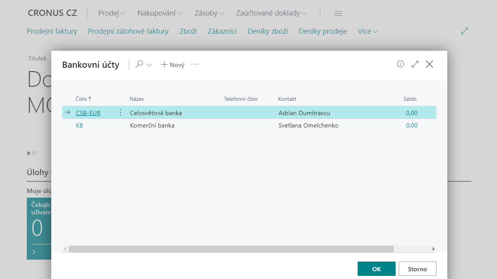
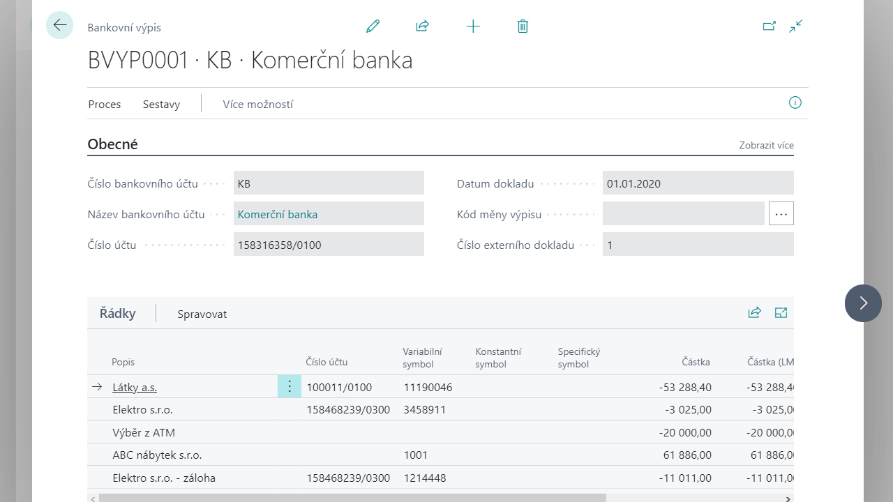
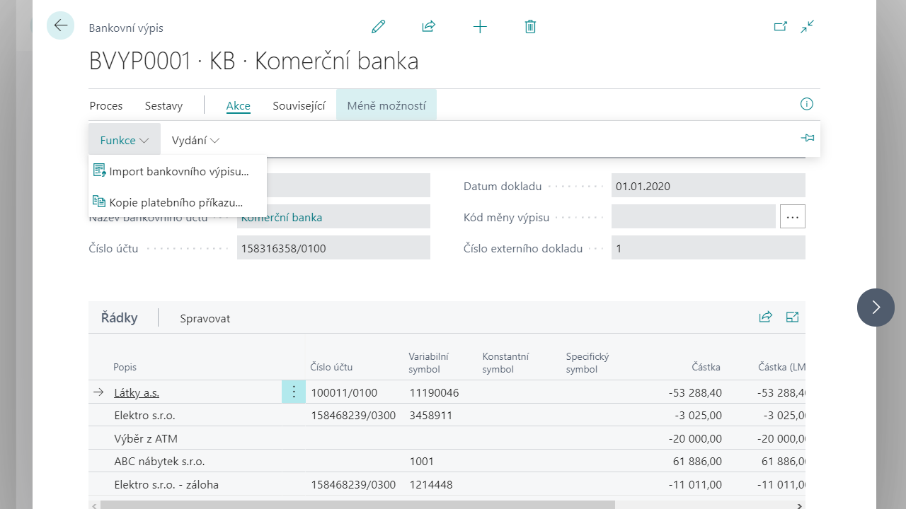
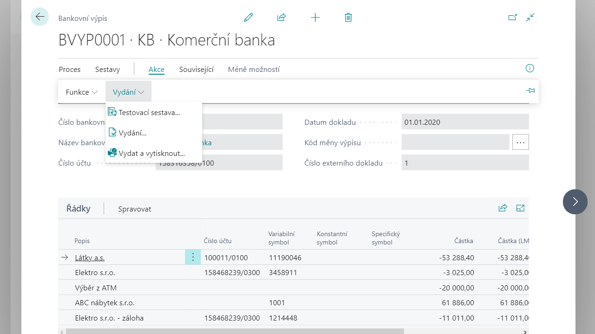

# Správa bankovních výpisů
Správa bankovních výpisů umožňuje ruční i automatickou tvorbu a zpracování bankovních výpisů. 

## Vytvoření bankovního výpisu
### Vytvoření bankovního výpisu - Ruční vytvoření řádků bankovního výpisu

Pro vytvoření nového bankovního výpisu postupujte následujícím způsobem:

1. Vyberte ikonu , zadejte **Bankovní výpisy** a poté vyberte související odkaz.
2. Otevře se stránka s přehledem bankovních účtů, ve které se zobrazí všechny založené bankovní účty. Zde označte bankovní účet, pro který budete vytvářen bankovní výpis a potvrďte kliknutím na tlačítko **OK**.
    
3. Po potvrzení účtu se otevře stránka **Bankovní výpisy**, která zobrazuje nevydané bankovní výpisy daného bankovního účtu. 
4. Nový výpis vytvoříte kliknutím na akci **Nový**. Otevře se stránka karta nově vytvořeného bankovního výpisu.
5. Hlavička obsahuje obecné informace bankovního výpisu. Tyto informace je potřeba vyplnit v následujících polích:
    -  Do pole **Číslo** systém automaticky doplní číslo z číselné řady. Pokud je u dané řady povoleno ruční číslování může uživatel zadat číslo výpisu ručně.
    - Pole **Číslo bankovního účtu**, **Název bankovního účtu** a **Číslo účtu** se doplní automaticky z nastavení karty bankovního účtu. 
    - V poli **Kód měny** je doplněna měna, ve které je veden bankovní účet. V poli **Kód měny** výpisu lze zadat kód měny, ve které bude výpis zpracován (program ve výchozím stavu doplní měnu z karty bankovního účtu).
    - Do pole **Datum dokladu** zadejte datum bankovního výpisu.
    - Pole **Číslo externího dokladu** je povinné a musí být před vydáním výpisu vyplněné. Do tohoto pole se zadává číslo výpisu přiřazené bankou. Při vydání bankovního výpisu systém kontroluje, zda se mezi vydanými bankovními výpisy daného bankovního účtu již nenachází výpis se stejným číslem externího dokladu.
    - V poli **Počet řádků** je uveden počet řádků, které daný výpis obsahuje. 
    - **Kód pravidla hledání** určuje kód pravidla pro párování řádků z bankovních výpisů.
    - Dále hlavička obsahuje na záložce **Debet/Kredit** statistiku částek výpisu v lokální měně a v měně výpisu.

6. Po vyplnění hlavičky dokladu je nutné zadat řádky. Pro ruční zadání řádku je nutné vyplnit následující pole:
    - V poli **Typ** je možné zadat subjekt, kterého se bude týkat daný řádek. Lze zvolit z pěti možností: **Zákazník** (vyrovnání zákaznických dokladů), **Dodavatel** (vyrovnání dodavatelských dokladů), **Bankovní účet** (převody částek mezi vlastními bankovními účty), **Zaměstnanec** (vyrovnání položek zaměstnance) nebo **Prázdný** pro ostatní případy. 
    - V závislosti na předchozí volbě se v poli **Číslo** vybere číslo zákazníka, dodavatele, bankovního účtu, nebo zaměstnance, kterého se bude týkat daný řádek výpisu. 
    - **Kód banky Zákazníka/dodavatele** – pokud je u zákazníka/dodavatele v systému evidován bankovní účet, tak jej lze v tomto poli vybrat a systém do řádku výpisu doplní jeho kód a bankovní účet se propíše do pole **Číslo účtu**, případně si vyplní pole pro identifikaci zahraničních plateb **IBAN** a **Kód SWIFT**.
    - Další identifikátory bankovní transakce, které je možné zadat, jsou **Variabilní symbol**, **Specifický symbol** a **Konstantní symbol**.
    - Do pole **Popis** je možno doplnit popis daného řádku.
    - Do pole **Částka** se zadá částka transakce s příslušným znaménkem. 
        
7. Po vyplnění řádků dokladu je možné **Vydat** platební výpis nebo **Vydat a Vydat a vytvořit deník**.

###  Vytvoření bankovního výpisu - Vytvoření řádků výpisu kopií vydaného platebního příkazu
Systém umožňuje vytvořit řádky bankovního výpisu přímou kopií vydaného platebního příkazu. 

1. Postup vytvoření platebního výpisu je stejný jako u ručního, jen je v kroku **č.6** (viz předchozí postup) je nutné použít v pásu karet v části Akce funkci **Kopie platebního příkazu**.
2. Systém otevře stránku požadavků **Kopie příkazu do výpisu**. Zde vybere, který vydaný platební příkaz chcete kopírovat. Řádky příkazu se poté zkopírují do řádků výpisu. 
3. Další provedené operace (bankovní poplatky, úroky, přijaté platby) je možné do řádků bankovního výpisu doplnit ručně. Před vydáním bankovního výpisu lze řádky upravit nebo vymazat.
4. Po vyplnění řádků dokladu je možné **Vydat** platební výpis nebo **Vydat a Vydat a vytvořit deník**.

## Import bankovního výpisu
Pomocí funkce Importu bankovního výpisu lze do řádků bankovního výpisu naimportovat řádky ze souboru, který byl vygenerován bankovním softwarem. 

Pro import bankovního výpisu postupujte následujícím způsobem:
1. Vytvořte hlavičku bankovního výpisu stejně tak jako u *Vytvoření bankovního výpisu - Ruční vytvoření řádků bankovního výpisu*. 
2. Místo ručního vyplnění řádku, nebo funkce kopie bankovního příkazu použijte funkci **Import bankovního výpisu**.
3. Před vydáním bankovního výpisu lze naimportované řádky upravit nebo vymazat.

## Vydání bankovního výpisu a vytvoření deníku plateb
Po kontrole vygenerovaných řádků bankovního výpisu lze bankovní výpis vydat. Vydání bankovního výpisu se provede pomocí funkce **Vydání** na pásu karet. Lze zvolit, zda bude bankovní výpis vydán nebo vydán a zároveň bude vytvořen deník pro další zpracování, zaúčtování bankovního výpisu.

Po vydání se bankovní výpis přesune do archivu do Vydaných bankovních výpisů. Z karty **Vydaného bankovního výpisu** lze vytvořit/zobrazit deník pro zaúčtování výpisu.

## Zaúčtování bankovního výpisu
Pro zaúčtování je potřeba vydaný bankovní výpis převést do deníku plateb nebo do deníku odsouhlasení plateb. Deník plateb, nebo deník odsouhlasení plateb lze vytvořit rovnou při vydání bankovního výpisu nebo pak z již **Vydaného bankovního výpisu** pomocí akce **Vytvořit deník**.

>[!IMPORTANT]
>Pouze varianta zpracování výpisu deníkem plateb umožňuje automatické párování řádků výpisu dle pravidel hledání, která jsou popsána výše v tomto dokumentu. Proto bude dále popsána pouze tato varianta způsobu zaúčtování bankovního výpisu.

Při vytváření deníku plateb se spouští automatické vyrovnání položek bankovního výpisu na základě nastavených pravidel hledání. **Kód pravidla hledání** je vyplněn v hlavičce vydaného výpisu a lze jej zde editovat. Což může být užitečné v případě, kdy potřebujete zvolit jiná pravidla pro hledání položek k automatickému vyrovnání na daném bankovním výpisu.

Vytvořený deník plateb lze otevřít z **Vydaného bankovního výpisu** pomocí volby **Otevřít odsouhlasení nebo deník**.

V případě, že byly na základě pravidel hledání nalezeny položky pro párování, obsahuje deník plateb řádky s vyplněnými poli **Typ vyrovnání dokladu** a **Číslo vyrovnání dokladu** nebo **Číslo zálohy** a odpovídajícím způsobem jsou pak doplněna pole **Typ účtu** a **Číslo účtu**. 
Pokud byly na základě pravidel hledání typu **Textové mapování** nalezeny položky např. bankovních poplatků nebo úroků, jsou doplněna čísla finančních účtů, na které mají být částky zaúčtovány.
V poli **Typ protiúčtu** a **Číslo protiúčtu** je potom uveden bankovní účet výpisu. 
V poli **Popis** jsou podrobnější údaje o položce z bankovního výpisu.
Pravidlo hledání podle, kterého byl řádek automaticky vyrovnán, je zaznamenáno v polích **Kód pravidla hledání** a **Kód řádku pravidla hledání**. Kliknutím na hodnotu v poli **Kód řádku pravidla hledání** lze pak zobrazit detailní informace o nastavení pravidla, které bylo pro vyhledání položky k vyrovnání aplikováno.

V případě, že pro transakci na výpisu nebyla nalezena odpovídající položka zákazníka, zaměstnance, nebo dodavatele, bude v poli **Typ účtu** hodnota **Finanční účet** a v poli **Číslo účtu** číslo účtu nastaveného na kartě bankovního účtu v poli **Účet nepřiřazených plateb**. Uživatel v tom případě musí řádky finančního deníku ručně upravit.

V případě že nedošlo k automatickému vyrovnání položek, je možné položky vyrovnat ručně vyplněním předmětných polí.

## Zpracování výpisu v deníku plateb, nebo do deníku odsouhlasení plateb

Primární způsob zpracovávání vydaného bankovního výpisu je s využitím vlastního párovacího mechanismu **Pravidel hledání** do **Deníku plateb**.
Bankovní výpis je však možné zpracovat také přes standardní párovací mechanismus **Pravidla vyrovnání plateb** do **Deníku odsouhlasení plateb**. Zde však již bez specifických úprav párování dle rozšiřujících identifikátorů bankovní transakce (**Variabilní symbol**, **Specifický symbol** a **Konstantní symbol**) a bez párování na zálohové doklady.

### Rozcestník pro zpracování vydaného výpisu do deníku plateb, nebo do deníku odsouhlasení plateb:
- Rozhodující je hodnota pole **Kód pravidla hledání** v hlavičce vydaného bankovního výpisu.
- Pole se v hlavičce výpisu plní při vytvoření výpisu hodnotou z pole **Kód pravidla hledání** z karty bankovního účtu. Pokud na bankovním účtu pole není nastaveno, tak se vyplní pravidlo hledání, které má na své kartě aktivováno pole Výchozí. Pokud ani takové nebude existovat, tak pole bude v hlavičce výpisu prázdné. 
- Pole **Kód pravidla hledání** se při vydání bankovního výpisu kopíruje do Vydaného bankovního výpisu.
- Pokud je v hlavičce vydaného výpisu pole **Kód pravidla hledání**:
    - **Neprázdné**, tak se výpis zpracuje přes Deník plateb (šablona a list deníku definovaná na daném bankovním účtu) a použije se vlastní párovací mechanismus **Pravidla hledání**.
    - **Prázdné**, tak se výpis zpracuje přes **Deník odsouhlasení plateb** a použije se standardní párovací mechanismus **Pravidla vyrovnání plateb**.

## Viz také
[Bankovní doklady pro Česko (rozšíření)](ui-extensions-banking-documents-localization-cz.md)  
[České lokální funkcionality](czech-local-functionality.md)  
[Finance](../../finance.md)
