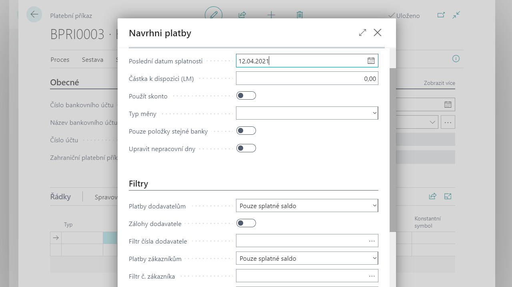
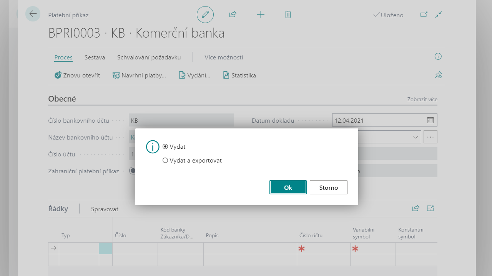

# Správa příkazů

Správa příkazů k úhradě umožňuje ruční i automatickou tvorbu příkazů k úhradě na základě dat v databázi. Vytvořené příkazy je možné vytisknout nebo exportovat ze systému do souboru, který je možno předat bance.

## Vytvoření platebního příkazu - Ruční zadání řádků platebního příkazu
1. Vyberte ikonu , zadejte **Platební příkazy** a poté vyberte související odkaz.
2. Otevře se stránka s přehledem bankovních účtů, ve které se zobrazí všechny založené bankovní účty. Zde označte bankovní účet, pro který budete vytvářet platební příkaz a potvrďte kliknutím na tlačítko **OK**.
    
3. Po potvrzení účtu se otevře stránka **Platební příkazy**, která zobrazuje nevydané platební příkazy daného bankovního účtu. 
4. Nový platební příkaz vytvoříte kliknutím na akci **Nový**. Otevře se stránka karty nově vytvořeného platebního příkazu.
5. V hlavičce dokladu se nacházejí následující pole, které je potřeba vyplnit:
    - Do pole **Číslo** systém automaticky doplní číslo z číselné řady. Pokud je u dané řady povoleno ruční číslování, může uživatel zadat číslo bankovního příkazu ručně.
    - Pole **Číslo bankovního účtu**, **Název bankovního účtu** a **Číslo účtu** se doplní automaticky z nastavení karty bankovního účtu. 
    - V poli **Kód měny** je doplněna měna, ve které je veden bankovní účet. V poli Kód měny příkazu lze zadat kód měny, ve které bude příkaz vystaven (program ve výchozím stavu doplní měnu z karty bankovního účtu).
    - Pole **Zahraniční platební příkaz** se používá pro řízení tiskové podoby příkazu a formátu exportu plateb.
    - Do pole **Datum dokladu** zadejte datum platebního příkazu.
    - V poli **Číslo externího dokladu** lze platební příkaz evidovat také pod jiným číslem.
    - V poli **Počet řádků** je uveden počet řádků, které daný platební příkaz obsahuje. V poli Datum a čas kontroly nespolehlivosti je zaznamenán datum a čas, kdy proběhla v daném platebním příkazu kontrola nespolehlivosti plátce DPH.
    - Dále hlavička obsahuje na záložce **Debet/Kredit** statistiku částek příkazu v lokální měně a v měně příkazu.  
    
6. Po vyplnění hlavičky dokladu je nutné zadat řádky. Pro ruční zadání řádku je nutné vyplnit následující pole:  
    - V poli **Typ** je možné zadat subjekt, kterého se bude týkat daný řádek. Lze zvolit z pěti možností: **Zákazník** (vyrovnání zákaznických dokladů), **Dodavatel** (vyrovnání dodavatelských dokladů), **Bankovní účet** (převody částek mezi vlastními bankovními účty), **Zaměstnanec** (vyrovnání položek zaměstnance) nebo **Prázdný** pro ostatní případy.
    - V závislosti na předchozí volbě se v poli **Číslo** vybere číslo zákazníka, dodavatele, bankovního účtu, nebo zaměstnance, kterého se bude týkat daný řádek příkazu.
    - **Kód banky Zákazníka/dodavatele** – pokud je u zákazníka/dodavatele v systému evidován bankovní účet a nastaven na kartě do pole Kód preferovaného bankovního účtu, tak systém zde do řádků příkazu doplní jeho kód a bankovní účet se propíše do pole Číslo účtu.
    - Do pole **Popis** je možno doplnit popis daného řádku.
    - Na základě předchozích voleb je možné v poli **Vyrov. pol. Zák/Dod/Zam číslo** vybrat konkrétní položku zákazníka, dodavatele nebo zaměstnance a v návaznosti na informacích, které tato položka obsahuje, doplní systém data do řádku příkazu, jako například **Variabilní symbol, Číslo účtu**.
    - Do pole **Částka** se navrhne obsah pole **Zůstatek** položky zmenšený o částku zbývajícího možného skonta, pokud datum splatnosti příkazu je menší než datum skonta na položce dodavatele nebo zákazníka. Částku lze v řádku příkazu změnit.
    
7. Po vyplnění řádků dokladu je možné **Vydat** platební příkaz.

## Vytvoření platebního příkazu - Automatické navržení řádků platebního příkazu 
Funkce automatického vygenerování řádků prochází doklady v systému, které mají zůstatek a nejsou zablokovány pro použití pro návrh příkazu (nemají vyplněn kód v poli Vyčkat), a vkládá je do řádků bankovního příkazu.

1. Postup vytvoření platebního příkazu je stejný jako u ručního, jen je v kroku **č.6** (viz předchozí postup) nutné použít v pásu karet v části Proces volbu **Navrhni platby**.
    
2. Dále vyplňte následující pole pro definici parametrů návrhu plateb: 
    - **Poslední datum splatnosti** – doplňte datum splatnosti, do kterého chcete řádky navrhnout. Systém bude procházet pouze položky s datem splatnosti před zde zadaným datem (včetně tohoto data)
    - **Částka k dispozici** – lze doplnit maximální částku příkazu, do které budou navrhovány položky
    - **Typ měny** – vyberte, dle jaké podmínky na měnu chcete navrhovat položky platebního příkazu. Pokud bude v poli zvolena prázdná hodnota, tak systém při návrhu nebude filtrovat položky na kód měny a do řádků příkazu navrhne položky s jejich původním kódem měny. Volbou Platební příkaz určujete, že systém bude navrhovat k platbě pouze položky, které mají stejný kód měny, jaký je zadaný v hlavičce platebního příkazu. Volba Bankovní účet definuje, že systém bude navrhovat k platbě pouze položky, které mají stejný kód měny, jaký je nastaven na kartě bankovního účtu
    - **Použít skonto** – aktivujte pole, pokud chcete, aby dávková úloha zahrnula dodavatelské položky, pro které můžete obdržet skonto slevu
    - **Pouze položky stejné banky** – aktivací tohoto pole určíte, že funkce bude do řádků navrhovat pouze položky, které mají stejný kód banky jako má bankovní účet v hlavičce příkazu
    - **Upravit nepracovní dny** – pole lze aktivovat jen v případě, že pole **Kód základního kalendáře** je na kartě bankovního účtu vyplněné. Kalendář specifikuje pracovní a nepracovní dny. Aktivací tohoto pole určujete, aby systém nenavrhoval datum splatnosti řádků platebního příkazu na nepracovní dny.
    - **Platby dodavatelům** – vyberte, zda chcete do platebního příkazu navrhnout dodavatelské položky. V případě volby **Pouze splatné saldo** systém navrhne položky dodavatele k úhradě pouze v případě, že celkové saldo dodavatele je splatné. Vybráním volby **Pouze závazky** určujete, že systém navrhne položky dodavatele k úhradě i v případě, kdy celkové saldo dodavatele není splatné. Při volbě Všechny položky systém navrhne všechny položky dodavatele. Pokud si nepřejete navrhovat položky dodavatele, tak v poli vyberte volbu **Nenavrhovat**.
    - **Zálohy dodavatele** – Pole aktivujte v případě, že chcete do automatického návrhu plateb zahrnout také nákupní zálohové doklady .
    - **Filtr čísla dodavatele** – v tomto poli můžete zadat filtr na vybrané dodavatele, jejichž doklady mají být zahrnuty do automatického návrhu plateb.
    - **Platby zákazníkům** – vyberte, zda chcete do platebního příkazu navrhnout zákaznické položky. V případě volby **Pouze splatné saldo** systém navrhne položky zákazníka k úhradě pouze v případě, že celkové saldo zákazníka je splatné. Vybráním volby **Pouze závazky** určujete, že systém navrhne položky zákazníka k úhradě i v případě, kdy celkové saldo zákazníka není splatné. Při volbě **Všechny položky** systém navrhne všechny položky zákazníka. Pokud si nepřejete navrhovat položky zákazníka, tak v poli vyberte volbu **Nenavrhovat**.
    - **Filtr č. zákazníka** – v tomto poli můžete zadat filtr na vybrané zákazníky, jejichž doklady mají být zahrnuty do automatického návrhu plateb.
    - **Platby zaměstnancům** – vyberte, zda chcete do platebního příkazu navrhnout položky zaměstnanců. Při volbě Všechny položky systém navrhne všechny položky zaměstnance. Pokud si nepřejete navrhovat položky zaměstnanců, tak v poli vyberte volbu **Nenavrhovat**.
    - **Filtr čísla zaměstnance** – v tomto poli můžete zadat filtr na vybrané zaměstnance, jejichž doklady mají být zahrnuty do automatického návrhu plateb.
    - **Přeskočit uzavřené záznamy** – aktivace pole určuje, že položky uzavřených záznamů budou přeskočeny. Tedy pokud má dodavatel na kartě v poli Uzavřeno vybráno Platba, nebo Vše, tak položky tohoto dodavatele budou z automatického návrhu plateb vyjmuty. Obdobně v případě uzavřeného zákazníka a také v případě zaměstnance (zde uzavření určuje pole **Uzavřeno-ochrana soukromí**).
3. Po stisknutí tlačítka **OK** proběhne automatické navržení řádků platebního příkazu dle nastavených podmínek.
4. Po kontrole vygenerovaných řádků platebního příkazu je možné případně **smazat řádky**, které nechcete zahrnout do tohoto příkazu, nebo naopak **přidávat další řádky** a lze měnit i částky, které mají být hrazeny.

## Vydání platebního příkazu

Před vydáním platebního příkazu je možné provést kontrolu spolehlivosti plátce DPH spuštěním akce **Kontrola nespolehlivosti plátce DPH** v pásu karet dokladu platebního příkazu.

Pro vydání platebního příkazu postupujte následujícím způsobem:
1. Vyberte ikonu , zadejte **Platební příkazy** a poté vyberte související odkaz.
2. Otevře se stránka s přehledem bankovních účtů, ve které se zobrazí všechny založené bankovní účty. Zde označte bankovní účet, pro který budete vydávat platební příkaz a potvrďte kliknutím na tlačítko **OK**.
3. Po potvrzení účtu se otevře stránka **Platební příkazy**, která zobrazuje nevydané platební příkazy daného bankovního účtu. 
4. Vyberte příkaz, který chcete vydat a otevřete ho.
5. Vydání platebního příkazu proveďte pomocí akce **Vydání** v pásu karet. Lze zvolit, zda bude platební příkaz vydán nebo vydán a rovnou exportován do souboru.
    
6. Po vydání se platební příkaz přesune do archivu do **Vydaných platebních příkazů**. Vydaný platební příkaz je needitovatelný. V tomto okamžiku před vlastním vytištěním příkazu nebo jeho exportem lze pouze stornovat řádky pro tisk nebo export.
6. **Storno řádků** se provede kliknutím na tlačítko Řádek, Storno. Stornované řádky jsou potom označené hodnotou Stornováno v poli Stav na řádku vydaného příkazu. Zároveň jsou odpovídající položky dodavatele, zákazníka nebo zaměstnance uvolněny pro další práci v systému. 

## Viz také
[Bankovní doklady pro Česko (rozšíření)](ui-extensions-banking-documents-localization-cz.md)  
[České lokální funkcionality](czech-local-functionality.md)  
[Finance](../../finance.md)
