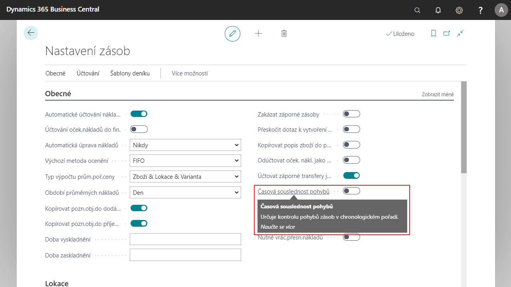

# Kontrola výdejů v zásobách - časová posloupnost

Standardní funkcionalita [!INCLUDE[d365fin](../../includes/d365fin_md.md)] byla doplněna o kontrolu časové návaznosti skladových operací. Po aktivaci kontroly je zabezpečeno, aby nebyl možný výdej zboží se zúčtovacím datem předcházejícím zúčtovacímu datu jeho příjmu.

## Aktivace kontroly výdeje v zásobách

1. Vyberte ikonu , zadejte **Nastavení zásob** a poté vyberte související odkaz.
2. Na kartě **Nastavení zásob** v záložce **Obecné** vyberte pole **Časová souslednost pohybů** a zapněte.
3. Po nastavení můžete kartu zavřít.

## Viz také

[Základní lokalizační balíček pro Česko](ui-extensions-core-localization-pack-cz.md)  
[Česká lokální funkcionalita](czech-local-functionality.md)  