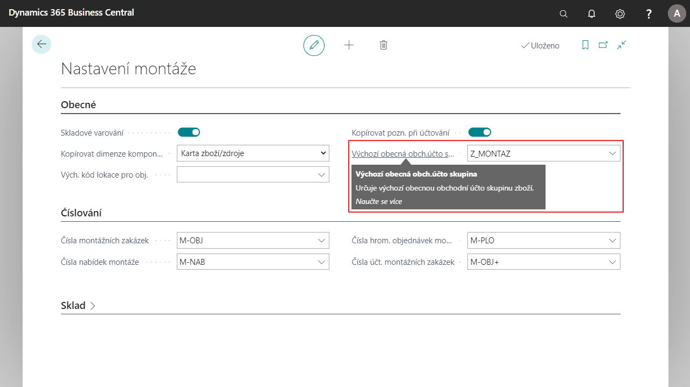

# Výchozí Obchodní účto skupina pro montážní objednávky

Usnadňuje práci s montážními zakázkami. V Nastavení montáže lze definovat Výchozí obecnou obchodní účto skupinu, jejíž hodnota se následně doplňuje do všech nově vytvořených montážních zakázek automaticky, není třeba je manuálně doplnit na každé montážní zakázce. Parametrizace tohoto pole ovlivňuje účtování montážní zakázky.

## Nastavení výchozí Obchodní účto skupiny zboží
1. Vyberte ikonu , zadejte **Nastavení montáže** a poté vyberte související odkaz.
2. Na kartě **Nastavení montáže** v záložce **Obecné** vyberte v poli **Výchozí obecná obchodní účto skupina** vyberte účto skupinu, kterou chcete nastavit jako výchozí.
3. Po nastavení můžete kartu zavřít.

## Viz Také
  
[Rozšířený lokalizační balíček pro Česko](ui-extensions-advanced-localization-pack-cz.md)  
[Česká lokální funkcionalita](czech-local-functionality.md)  
