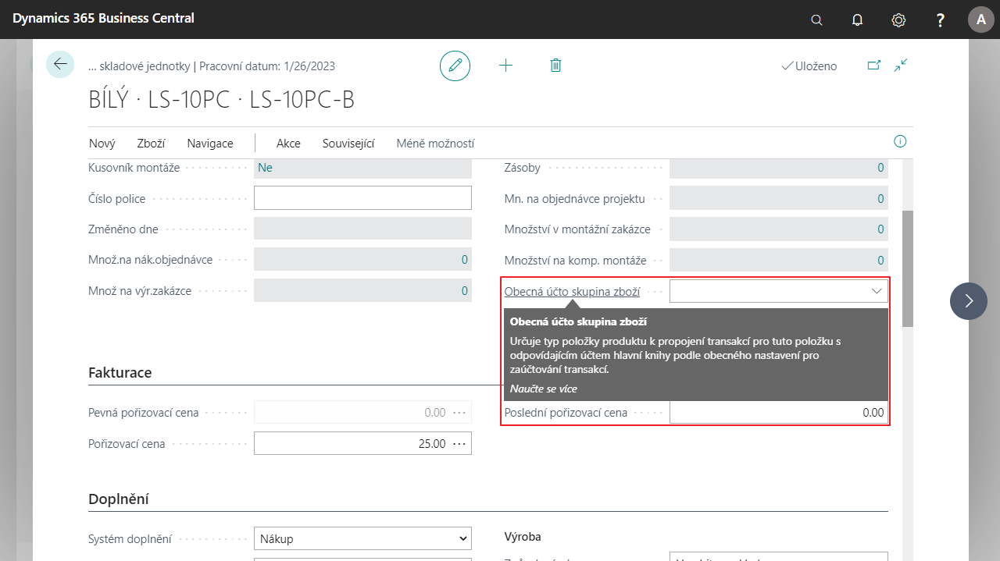

# Obecná účto skupina zboží ze skladové jednotky

Tato funkcionalita umožňuje nastavit kód Obecné účto-skupiny zboží na skladové jednotce. Tento kód se poté přenáší do nákupních a prodejních dokladů, deníku zboží, deníku projektu a řádek servisu:

## Nastavení účtoskupiny zboží na kartě skladové jednotky

1. Vyberte ikonu , zadejte **Zboží** a poté vyberte související odkaz.
2. Otevřete vybranou **kartu zboží**, na které chcete nastavit účto skupinu a poté vyberte tlačtíko **Skladové jednotky**
3. Otevřete vybranou **kartu skladové jednotky**.
4. V záložce Obecné vyberte pole **Obecná účto skupina zboží** a zadejte vybranou účtoskupinu.
5. Po vybrání kartu zavřete.

## Povolení použití Obecné účtokupiny zboží ze skladové jednotky

1. Vyberte ikonu , zadejte **Nastavení zásob** a poté vyberte související odkaz.
2. V zálože **Obecné** vyberte pole **Použít obecnou účto skupinu zboží ze skladové jednotky**.
3. Po zapnutí pole se účto skupina začne přenášet do patřičných dokladů a deníků.
4. Po nastavení kartu zavřete.

Po tomto nastavení bude obecná účto skupina zboží ze skladové jednotky převedena do dokladů.

## Viz také

[Základní lokalizační balíček pro Česko](ui-extensions-core-localization-pack-cz.md)  
[Česká lokální funkcionalita](czech-local-functionality.md)  