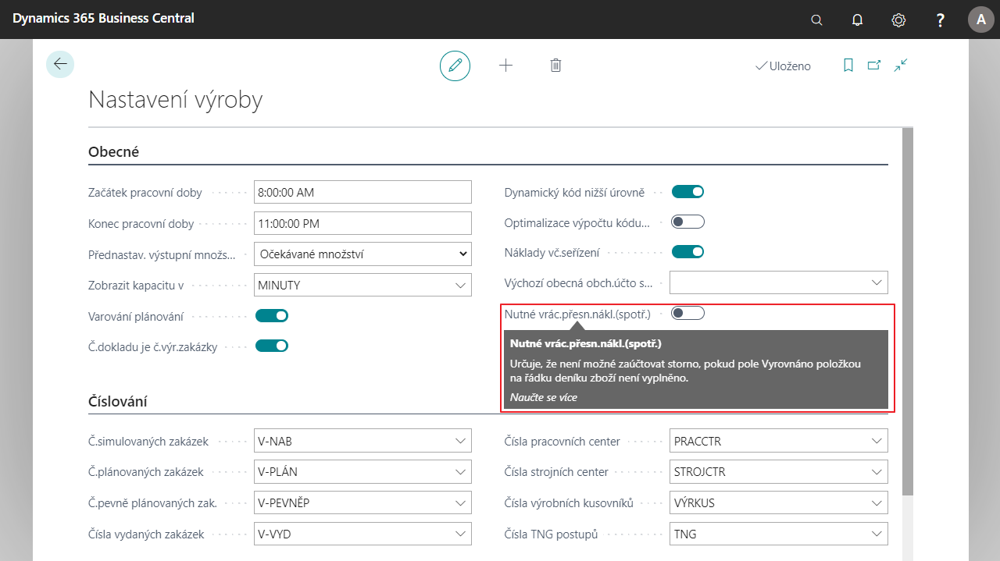

# Povinné vrácení přesných nákladů ve výrobě

Povinné vrácení přesných nákladů ve výrobě slouží k vyrovnání správné položky při stronování spotřeby výroby. Uživatel musí ukázat přesně na položku, kterou spotřeboval ve výrobě, aby došlo ke správnému vyrování nákladů.

## Nastavení Povinného vrácení přesných nákladů ve výrobě
1. Vyberte ikonu , zadejte **Nastavení výroby** a poté vyberte související odkaz.
2. Na kartě **Nastavení výroby**, v záložce vyberte pole **Nutné přesné vrácení přesných nákladů**.
3. Po nastavení kartu můžete vypnout.

## Viz Také

[Rozšířený lokalizační balíček pro Česko](ui-extensions-advanced-localization-pack-cz.md)  
[Česká lokální funkcionalita](czech-local-functionality.md)
