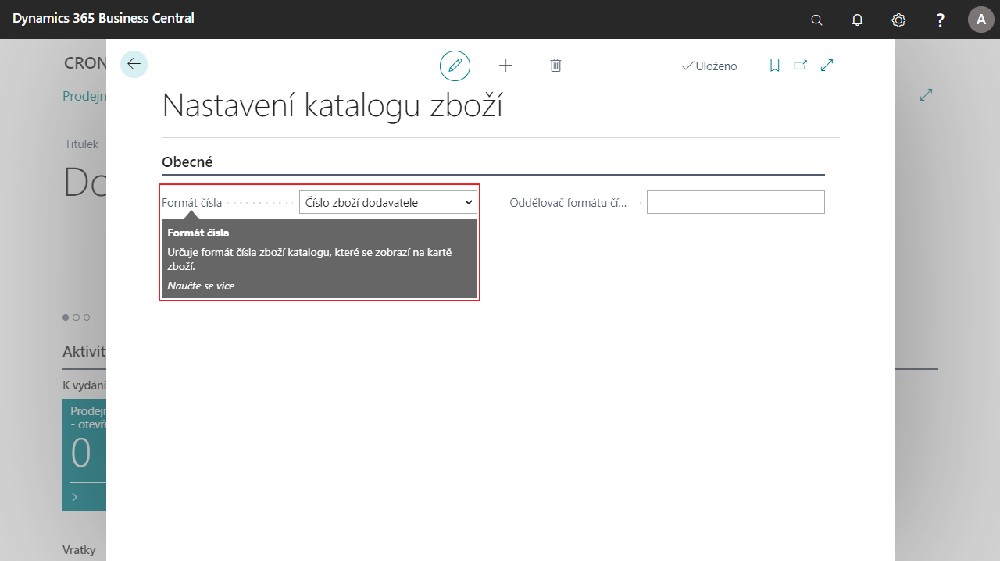

# Číslování neskladovaného zboží
Pomocí této funkčnosti lze změnit číslování karet zboží, které jsou vytvářeny z katalogu zboží. Ke stávajícím volbám byla přidána nová možnost číslovat zboží dle číselné řady pro Zboží z Nastavení zásob. Karty zboží vytvořené z katalogu zboží pak vznikají ve stejné číselné řadě jako ostatní karty zboží.

## Nastavení číslování neskladované zboží

1. Vyberte ikonu , zadejte **Nastavení zboží katalogu** a poté vyberte související odkaz.
2. Na kartě **Nastavení katalogu zboží** v záložce **Obecné** vyberte v poli **Formát čísla** hodnotu **Číselná řada zboží**.
3. Po nastavení můžete kartu zavřít.

## Viz Také

[Rozšířený lokalizační balíček pro Česko](ui-extensions-advanced-localization-pack-cz.md)  
[Česká lokální funkcionalita](czech-local-functionality.md)  
