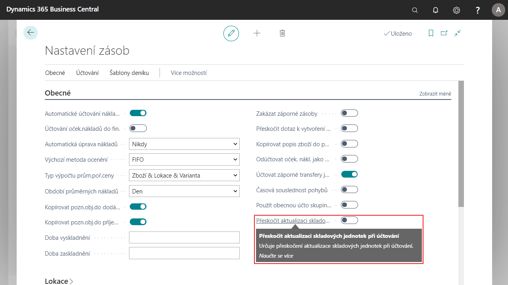

# Přeskočení aktualizace skladových jednotek při účtování

Při účtování skladové jednotky standardní funkčnost aktualizuje pole **Pořizovací cena** a **Poslední pořizovací cena** na kartě **Skladové jednotky**. V některých případech toto není z výkonnostních důvodů žádoucí, proto umožňuje CZ lokalizace tuto standardní funkčnost aktualizace vypnout​.

## Vypnutí funkce aktualizace skladových jednotek při účtování

1. Vyberte ikonu , zadejte **Nastavení zásob** a poté vyberte související odkaz.
2. V záložce **Obecné** vyberte zaškrtávací políčko **Přeskočit aktualizaci skladových jednotek**.
3. Po zapnutí tohoto pole se přestanou aktualizovat ceny na kartě skladové jednotky.
4. Po nastavení můžete Nastavení zásob zavřít.

## Viz také

[Rozšířený lokalizační balíček pro Česko](ui-extensions-advanced-localization-pack-cz.md)  
[Česká lokální funkcionalita](czech-local-functionality.md)  
