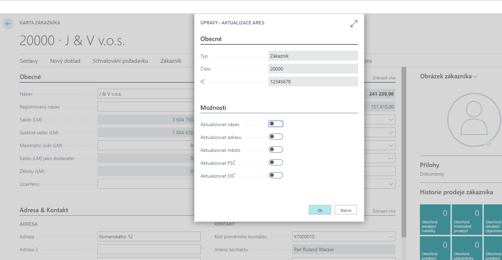

# Aktualizace kontaktů z ARES

ARES je zkratka pro Access to Register of Economic Subjects. ARES je informační systém umožňující získávání informací o ekonomických subjektech registrovaných v České republice.

## Nastavení služby ověření IČ
1. Vyberte ikonu , zadejte **Nastavení služby ověření IČ** a poté vyberte související odkaz.
2. Na kartě **Nastavení služby ověření IČ** v záložce **Obecné** vyberte pole **Koncový bod služby** a zkontrolujte nebo zadejte hodnotu "*http://wwwinfo.mfcr.cz/cgi-bin/ares/darv_bas.cgi*".
3. Pro zapnutí služby vyberte přepínač u pole **Povoleno**.
3. Po nastavení můžete kartu zavřít.

## Aktualizace pomocí ARES
  
Aktualizaci z ARES můžete spustit z karty kontaktu, dodavatele nebo zákazníka. Můžete vyhledávat společnosti a rozhodnout, která pole v [!INCLUDE[d365fin](../../includes/d365fin_long_md.md)] zaktualizujete (název, adresa, město, PSČ, DIČ).

### Aktualizace dat na kartě zákazníka
1. Vyberte ikonu , zadejte **Zákazníci** a poté vyberte související odkaz.
2. Vyberte vybraného zákazníka, u kterého chcete aktualizovat data.
3. Na kartě zákazníka v záložce Fakturace klikněte na tři tečky vedle políčka IČO.
4. Otevře se karta **Protokol ověření IČ**, kde použijte funkci **Ověřit IČ**. Po úspěšném ověření uvidíte v řádcích řádek se stavem **Platný**.
5. Nyní můžete použít funkci **Aktualizovat kartu** na stránce **Protokol ověření IČ**. 
6. Otevře se stránka **Aktualizace ARES**, kde můžete vybrat pole, která chcete aktualizovat:
    - Aktualizovat vše
    - Aktualizovat název
    - Aktualizovat adresu
    - Aktualizovat město
    - Aktualizovat PSČ
    - Aktualizovat DIČ
7. Po vybrání polí klikněte na **OK**, čímž se aktualizace dokončí.
8. Poté můžete stránku zavřít.
 
## Viz také

[Základní lokalizační balíček pro Česko](ui-extensions-core-localization-pack-cz.md)  
[České lokální funkcionality](czech-local-functionality.md)  
[Finance](../../finance.md)  
