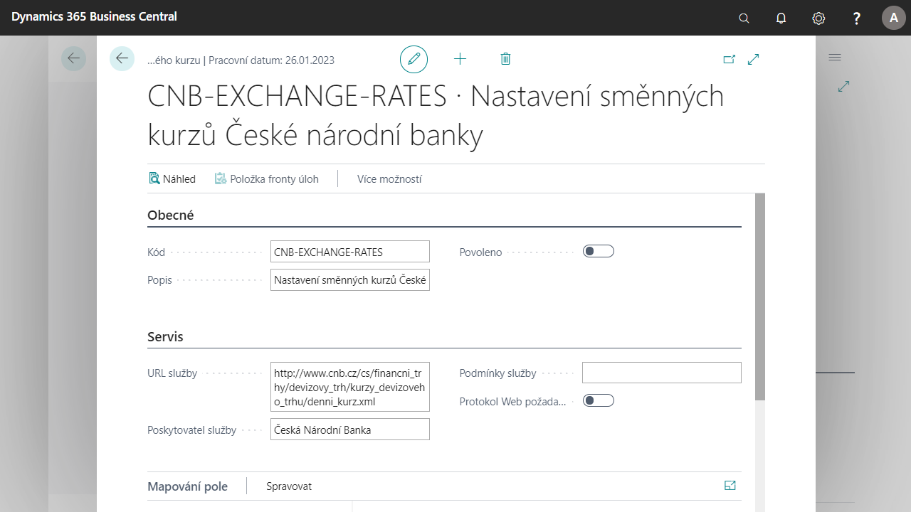

# Aktualizace směnného kurzu

Společnosti je umožněno automaticky aktualizovat směnné kurzy měn pomocí funkcí Služby směnného kurzu.
Ty byly vylepšeny o možnost automaticky aktualizovat směnné kurzy měn z ČNB (České Národní Banky).
Uživatel si může v nastavení služby směnného kurzu definovat http adresu služby a další parametry aktualizace směnných kurzů.

## Spuštění služby aktualizace směnného kurzu pomocí ČNB
1. Vyberte ikonu , zadejte **Služby směnného kurzu** a poté vyberte související odkaz.
2. V seznamu Služeb směnného kurzu vyberte **CNB-EXCHANGE-RATES - Nastavení směnných kurzů České národní banky**.
3. Na kartě služby směnného kurzu vyberte políčko **Povoleno** pro zapnutí služby.
4. Po zapnutí služby systém na pozadí založí položu fronty úloh: **Procedura ∙ 1281 ∙ Update Currency Exchange Rates**, zároveň se Vás systém zeptá, jestli chcete otevřít okno položky fronty úloh a zda chcete tuto položku nastavit.
5. V případě potvrzení, se Vám otevře položka fronty úloh, kterou můžete nastavit dle Vašich potřeb. Můžete zde například nastavit jakou periodou a v kolik hodin se mají směnné kurzy aktualizovat.
6. Po nastavení položky frotny úloh nastavte stav na **Vyčkávat**. Jakmile nastane okamžik aktualizace dle nastavení, procedura se spustí a aktualizuje měny.
7. Kartu položky fronty úloh můžete zavřít.

## Viz také

[Základní lokalizační balíček pro Česko](ui-extensions-core-localization-pack-cz.md)  
[České lokální funkcionality](czech-local-functionality.md)  
[Finance](finance.md)  

