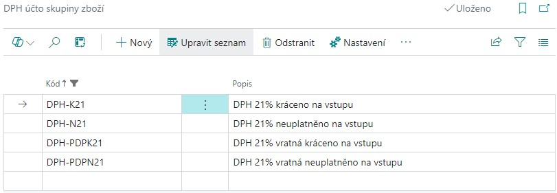
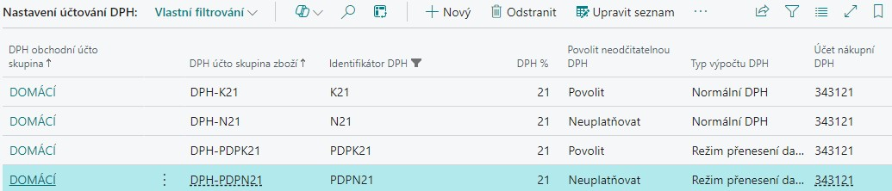
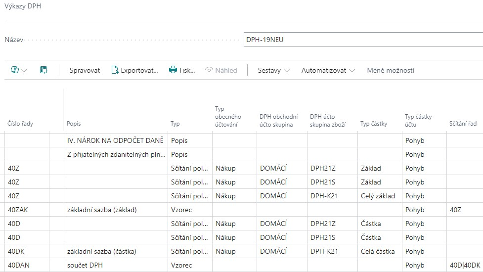
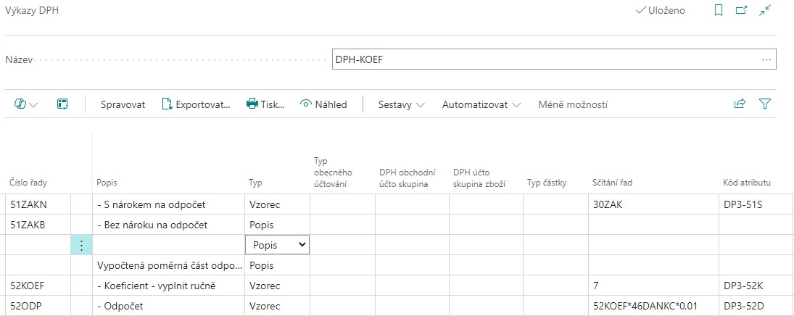

# Neodčitatelná DPH pro Česko

## Neodčitatelná DPH

Pokud plátce DPH použije přijatá zdanitelná plnění v rámci svých ekonomických činností jak pro plnění s nárokem na odpočet daně, tak pro osvobozená plnění, má nárok na odpočet daně pouze v krácené výši. DPH na vstupu se pak musí krátit vypočteným koeficientem. Funkčnost neodčitatelné DPH umožňuje aplikovat do účetních případů krátící koeficient.

Hodnotu krátícího koeficientu DPH je možné nastavit pro celou společnost na jednom místě. Hodnota bude použita pro všechny označené kombinace DPH účto skupin. Kromě krácení daně na vstupu prostřednictvím krátícího koeficientu je v kombinaci DPH účto skupin možné také nastavit 100% krácení daně, tzn. případ, kdy není nárok uplatňovat DPH na vstupu, ale na výstupní straně (v případě plnění v režimu přenesení daňové povinnosti) je třeba vykázat DPH v plném rozsahu. Krácení DPH je uzpůsoben i výkaz DPH a kontrolní hlášení DPH, do kterých vstupují celé nezkrácené částky. Po skončení kalendářního roku je možné na základě vypočteného vyúčtovacího koeficientu přepočítat všechny DPH položky v období a zaúčtovat rozdíl mezi původně použitým a vyúčtovacím koeficientem.

### Funkcionalita modulu zahrnuje

- nastavení neodčitatelné DPH v krácené nebo plné výši
- úpravu účtování DPH na vstupu, zahrnutí neodčitatelné DPH do souvisejících účtů, nákupní ceny zboží či majetku
- úpravu ve vykazování DPH a kontrolního hlášení DPH
- reporty pro odsouhlasení DPH
- vyúčtovací koeficient na konci kalendářního období

### Omezení aplikace

- není řešeno pro nákupní zálohové faktury
- není napojeno na Nastavení sestav DPH či Přehled přiznání k DPH

## Aktivace Neodčitatelné DPH

Aktivace funkcionality Neodčitatelné DPH se spouští na stránce **Nastavení DPH** nastavením pole **Povolit neodčitatelnou DPH.** Pokud máte instalovanou aplikaci **Core Localization Pack for Czech**, automaticky dojde k rozšíření standardní funkčnosti neodčitatelné DPH pro potřeby českého účtování a výkaznictví.

Přepnutím hodnoty pole **Povolit neodčitatelnou DPH** na hodnotu ANO jsou aktivována další související pole pro nastavení. Spuštěním funkčnosti jsou automaticky aktivována nová pole v tabulkách, zapnutí je nevratné.

## Základní principy účtování neodčitatelné DPH

Při použití neodčitatelné DPH na vstupu (částečné krácení prostřednictvím krátícího koeficientu nebo krácení v plném rozsahu bez nároku na odpočet) je hodnota nenárokové částky DPH připočítávána k základnímu účtu, na který je účetní případ účtován.

Pokud v Nastavení účtování DPH není v příslušné kombinaci DPH účto skupin v poli **Účet neodčitatelné nákupní DPH** nastaven žádný účet, připočítá se částka neodčitatelné DPH k účtu, který je použit v účetním zápisu. V opačném případě (tedy pokud nastavíte jakýkoli účet) je tento účet použit pro zaúčtování neodčitatelné části částky DPH.

Do účetnictví je na účty DPH částka zaznamenaná ve zkrácené hodnotě (příp. vůbec), do výkazů přiznání k DPH či kontrolního hlášení DPH je ale třeba vykazovat částky v původním rozsahu dle původního daňového dokladu. Aby bylo možné takto odlišit částky v účetnictví a částky ve výkaznictví, funkcionalita neodčitatelné DPH rozšířila tabulku Položky DPH o nová pole:

- **Základ** – standardní pole, zobrazuje částku kráceného základu
- **Částka** – standardní pole, zobrazuje částku krácené DPH
- **Neodčitatelný základ DPH** – zobrazuje částku základu neuplatňovanou v DPH
- **Neodčitatelná částka DPH –** zobrazuje částku DPH neuplatňovanou v DPH
- **Odčitatelný základ DPH –** zobrazuje částku základu DPH navýšenou o neodčitatelnou DPH
- **% neodčitatelné DPH –** zobrazuje hodnotu koeficientu DPH použitého na položce
- **Částka základu DPH (původní)** – zobrazuje hodnotu základu DPH na původním dokladu
- **Částka DPH (původní)** – zobrazuje částku DPH na původním dokladu

**Přiznání DPH** je třeba vykázat v původních částkách v původním nezkráceném rozsahu. Tomu je třeba uzpůsobit parametrizaci výkazu DPH – viz **Nastavení výkazu DPH**.

Rovněž **Kontrolní hlášení DPH** je třeba vykázat v původních částkách. Funkce pro načítání řádků kontrolního hlášení je přizpůsobena tak, že k načítání používá z položky DPH pole **Původní základ DPH** a **Původní částka** **DPH** z položky DPH. Krácené hodnoty do kontrolního výkazu nevstupují.

Na konci kalendářního období je třeba provést zpětně přepočet zálohového krátícího koeficientu (není řešeno v systému BC, je třeba postupovat vašim obvyklým způsobem). Hodnota vypočteného vyúčtovacího koeficientu se zapíše do **Nastavení neodčitatelné DPH** do příslušného pole a současně se nastaví jako hodnota zálohového koeficientu pro následující období. Pokud se vyúčtovací koeficient od zálohového liší, je třeba spustit dávkovou úlohu pro přepočet položek **Korekce DPH koeficientu.**

Tato dávková úloha prochází všechny položky DPH zadaného období s kombinacemi DPH účto skupin nastavených jako krácení daně na vstupu. Porovná hodnotu použitého krátícího koeficientu v poli **% neodčitatelné DPH** a hodnotu vyúčtovacího koeficientu, vypočte rozdíl a zaúčtuje ho jako novou DPH položku, ve které upraví základ i částku DPH. Rozdíl v DPH zaúčtuje na **Účet korekce koeficientu DPH** z **Nastavení účtování DPH**.

## Nastavení Neodčitatelné DPH

Pro práci s funkcionalitou Neodčitatelné DPH je třeba provést určitá nastavení:

### Nastavení rozsahu použití Neodčitatelné DPH

Funkcionalita neodčitatelné DPH je již svým zapnutím automaticky uplatňována při účtování účetních případů s přímým účtováním na finanční účty. Využít ji můžete i při účtování nákladů na zboží, pro náklady projektů či dlouhodobého majetku.

Na stránce **Nastavení DPH** aktivujte dle potřeby pole

- **Použít pro náklady zboží**
- **Použít pro náklady dlouhodobého majetku**
- **Použít pro náklady projektu**

Po aktivaci bude hodnota neodčitatelné DPH automaticky připočítána k pořizovací ceně zboží, pořizovacím nákladům majetku či nákladům projektu.

### Nastavení DPH účto skupin zboží

Pro účtování účetních případů s neodčitatelnou DPH na vstupu je třeba vytvořit nové **DPH účto skupiny zboží.** Pokud budete účtovat účetní zápisy s krácením DPH na vstupu i případy, kdy DPH na vstupu uplatňovat nebudete vůbec, nastavte si pro tyto případy samostatné DPH účto skupiny zboží, např. takto:

  

### Nastavení účtování DPH

DPH účto skupiny zboží vytvořené pro účtování neodčitatelné DPH je třeba nastavit pro kombinaci s DPH obchodní účto skupinou a definovat, jakým způsobem bude o neodčitatelné DPH účtováno:

V poli **Povolit neodčitatelnou DPH** pro vybranou kombinaci zvolte, zda budete účtovat o neodčitatelné DPH

- **nepovolit** = standardní kombinace DPH účto skupin, u které bude uplatňováno DPH v plném rozsahu
- **povolit** = nastavení pro použití krácení DPH koeficientem na vstupu dle **Nastavení neodčitatelné DPH**
- **neuplatňovat** \= nastavení pro případ, kdy DPH na vstupu nebude uplatňováno, na výstupu bude v plném původním rozsahu, tedy 100% krátící koeficient.

  

Pro kombinace DPH účto skupin označené hodnotou Povolit v poli Povolit neodčitatelnou DPH je třeba nastavit **Účet korekce koeficientu DPH**, na který bude účtován rozdíl mezi krátícím zálohovým a vyúčtovacím koeficientem na konci kalendářního období

### Nastavení neodčitatelné DPH

Hodnota krátícího koeficientu DPH se v systému nastavuje na stránce **Nastavení neodčitatelné DPH.** Pro kalendářní účetní období je třeba nastavit **zálohový koeficient**, na konci období pak doplnit hodnotu přepočteného **vyúčtovacího koeficientu**.

Oba koeficienty se nastavují v hodnotách procent „neuplatňované části DPH“, tzn. pokud je vypočtený krátící koeficient v hodnotě 7 % a je tedy nárok uplatnit DPH na vstupu pouze v rozsahu 7 %, hodnota zálohového koeficientu v systému (tedy hodnota neodčitatelné DPH) bude rovna 93.

S nastavením vyúčtovacího koeficientu souvisí i **Nastavení kódu původu**. Na této stránce je třeba nastavit **Kód původu** použitý při ročním vyúčtování rozdílu mezi zálohovým a vyúčtovacím koeficientem. Nastavte hodnotu do pole **Korekce DPH koef.**

### Nastavení výkazu DPH

Výkaz DPH je třeba doplnit o nově založené kombinace DPH účto skupin. Protože do výkazu DPH musí vstupovat částky v původních hodnotách, je třeba upravit parametrizaci řádků v poli **Typ částky**, ve kterých je třeba použít hodnoty **Celý základ** nebo **Celá částka**.

  

## Účtování neodčitatelné DPH v dokladech

Níže uvedené příklady předpokládají předchozí nastavení neodčitatelné DPH, vytvořené kombinace DPH účto skupin a nastavení zálohového koeficientu pro vybrané účetní období – viz. odstavec Nastavení Neodčitatelné DPH.

### Příklad použití krácené DPH v nákupní faktuře – normální daň

1. Vyberte ikonu , zadejte **Nákupní faktury** a vyberte související odkaz
2. Na stránce **Nákupní faktury** založte pomocí akce **Nový** novou nákupní fakturu.
3. Doplňte hlavičku nákupní faktury obvyklým způsobem – zvolte číslo z číselné řady, vyberte číslo dodavatele, zúčtovací datum, datum DPH, číslo externího dokladu.
4. Do řádku nákupní faktury zvolte v poli **Typ** hodnotu Finanční účet a v poli **Číslo** vyberte z účetní osnovy nákladový účet, např. 518100.
5. V polích **DPH obchodní účto skupina** a **DPH účto skupina zboží** zvolte kombinaci, která je nastavená pro normální DPH krácenou na vstupu krátícím koeficientem
6. Vyplňte množství =1 a nákupní cenu bez DPH v hodnotě 1.000
7. Spusťte náhled účtování.
8. Zobrazte věcné položky. Na účet 518100 je účtována základní nákladová cena 1000 plus dalším zápisem poměrná částka neuplatněné DPH. Částka DPH je snížena krátícím koeficientem
9. Zobrazte položky DPH. V polích pro Základ a Částku jsou uvedeny částky odpovídající hodnotě zkrácené, odčitatelné DPH. V polích **Původní základ DPH** a **Původní částka DPH** jsou uvedeny hodnoty základu a částky DPH dle hodnot v původním dokladu, tedy bez krácení. V poli **% neodčitatelné DPH** je uvedena hodnota zálohového koeficientu DPH.

### Příklad použití krácené DPH v nákupní faktuře – DPH v režimu přenesení daňové povinnosti

1. Vyberte ikonu , zadejte **Nákupní faktury** a vyberte související odkaz
2. Na stránce **Nákupní faktury** založte pomocí akce **Nový** novou nákupní fakturu.
3. Doplňte hlavičku nákupní faktury obvyklým způsobem – zvolte číslo z číselné řady, vyberte číslo dodavatele, zúčtovací datum, datum DPH, číslo externího dokladu.
4. Do řádku nákupní faktury zvolte v poli **Typ** hodnotu Finanční účet a v poli **Číslo** vyberte z účetní osnovy nákladový účet, např. 518100.
5. V polích **DPH obchodní účto skupina** a **DPH účto skupina zboží** zvolte kombinaci, která je nastavená pro DPH v režimu přenesení daňové povinnosti krácenou na vstupu krátícím koeficientem.
6. Vyplňte množství =1 a nákupní cenu bez DPH v hodnotě 1.000
7. Spusťte náhled účtování.
8. Zobrazte věcné položky. Na účet 518100 je účtována základní nákladová cena 1000 plus dalším zápisem poměrná částka neuplatněné DPH. Částka DPH na vstupu je snížena krátícím koeficientem. Částka DPH na výstupu je účtována v plném rozsahu.
9. Zobrazte položky DPH. V polích pro Základ a Částku jsou uvedeny částky odpovídající hodnotě zkrácené, uplatňované DPH. V polích **Původní základ DPH** a **Původní částka DPH** jsou uvedeny hodnoty základu a částky DPH dle hodnot v původním dokladu, tedy bez krácení. V poli **% neodčitatelné DPH** je uvedena hodnota zálohového koeficientu DPH

### Příklad použití neuplatňované DPH v nákupní faktuře – normální daň

1. Vyberte ikonu , zadejte **Nákupní faktury** a vyberte související odkaz
2. Na stránce **Nákupní faktury** založte pomocí akce **Nový** novou nákupní fakturu.
3. Doplňte hlavičku nákupní faktury obvyklým způsobem – zvolte číslo z číselné řady, vyberte číslo dodavatele, zúčtovací datum, datum DPH, číslo externího dokladu.
4. Do řádku nákupní faktury zvolte v poli **Typ** hodnotu Finanční účet a v poli **Číslo** vyberte z účetní osnovy nákladový účet, např. 518100.
5. V polích **DPH obchodní účto skupina** a **DPH účto skupina zboží** zvolte kombinaci, která je nastavená pro normální DPH neuplatňovanou na vstupu (100% krácení)
6. Vyplňte množství =1 a nákupní cenu bez DPH v hodnotě 1.000
7. Spusťte náhled účtování.
8. Zobrazte věcné položky. Na účet 518100 je účtována základní nákladová cena 1000 plus dalším zápisem celá částka vypočítaného DPH. Na účty DPH není vůbec účtováno.
9. Zobrazte položky DPH. V polích pro Základ a Částku jsou uvedeny nulové částky. V polích **Původní základ DPH** a **Původní částka DPH** jsou uvedeny hodnoty základu a částky DPH dle hodnot v původním dokladu, tedy bez krácení.

### Příklad použití neuplatňované DPH v nákupní faktuře – DPH v režimu přenesení daňové povinnosti

1. Vyberte ikonu , zadejte **Nákupní faktury** a vyberte související odkaz
2. Na stránce **Nákupní faktury** založte pomocí akce **Nový** novou nákupní fakturu.
3. Doplňte hlavičku nákupní faktury obvyklým způsobem – zvolte číslo z číselné řady, vyberte číslo dodavatele, zúčtovací datum, datum DPH, číslo externího dokladu.
4. Do řádku nákupní faktury zvolte v poli **Typ** hodnotu Finanční účet a v poli **Číslo** vyberte z účetní osnovy nákladový účet, např. 518100.
5. V polích **DPH obchodní účto skupina** a **DPH účto skupina zboží** zvolte kombinaci, která je nastavená pro DPH v režimu přenesení daňové povinnosti krácenou na vstupu 100 %, tedy neuplatňovanou na vstupu
6. Vyplňte množství =1 a nákupní cenu bez DPH v hodnotě 1.000
7. Spusťte náhled účtování.
8. Zobrazte věcné položky. Na účet 518100 je účtována základní nákladová cena 1000 plus dalším zápisem celá částka vypočítaného DPH. DPH na vstupu není vůbec účtováno, částka DPH na výstupu je účtována v plném rozsahu.
9. Zobrazte položky DPH. V polích pro Základ a Částku jsou uvedeny nulové částky. V polích **Původní základ DPH** a **Původní částka DPH** jsou uvedeny hodnoty základu a částky DPH dle hodnot v původním dokladu, tedy bez krácení.

## Výkaznictví DPH s Neodčitatelnou DPH

Pro **Přiznání k DPH** je třeba upravit parametrizaci výkazu DPH tak, aby u řádků obsahujících kombinace DPH účto skupin krácených nebo zcela neuplatňovaných na vstupu byly zahrnuty celé částky v původních hodnotách.

Hodnotu krátícího koeficientu je pak možné nastavit ručně do příslušného řádku výkazu DPH s hodnotou v poli **Typ** \= Vzorec. Aby bylo možné provést přepočet vstupní DPH jen pro vybrané řady výkazu, je třeba pro části, které zahrnují jak plná, tak krácená či neuplatňovaná plnění, vytvořit samostatné součtové řádky, ve kterých se budou součtovat samostatně plná, krácená a neuplatňovaná plnění.

  

Přiznání k DPH je třeba exportovat v původním rozsahu a krácení provést až pro vybrané součtové řady, příp. provést krácení až na stránkách Daňového portálu.

**Kontrolní hlášení DPH** je třeba podávat v původních částkách dokladu, nikoli v částkách krácených či neuplatňovaných. Úloha pro načítání řádků kontrolního hlášení proto využívá polí **Původní základ DPH a Původní částka DPH** z položky DPH. Krácené částky do výkazu nevstupují.

## Kontrolní sestavy neodčitatelné DPH

Sestava **Podklad pro DPH** (**Záznamní povinnost**) obsahuje sloupce s hodnotami DPH v původních částkách i částkách krácených. Celková hodnota sloupce Částka (LM) je kontrolou na účetnictví, celková hodnota sloupce Původní částka DPH je kontrolou na výkaz DPH v původních částkách.

Pro sestavu **Seznam daňových dokladů** existuje samostatné rozvržení sestavy, ve kterém jsou sloupce s hodnotami DPH v původních částkách i částkách krácených. Celková hodnota sloupce Částka (LM) je kontrolou na účetnictví, celková hodnota sloupce Původní částka DPH je kontrolou na výkaz DPH v původních částkách.

## Vyúčtovací koeficient DPH

Po skončení kalendářního roku účetní jednotka využívající krátící koeficient DPH provede přepočet plnění za uplynulý rok a výpočet konečného vyúčtovacího koeficientu DPH (mimo systém BC).

Nově vypočtený koeficient je třeba zapsat do **Nastavení neodčitatelné DPH** jako vyúčtovací koeficient ukončeného období a současně jako zálohový koeficient pro nové účetní období.

Pokud se koeficienty v ukončeném období liší, je možné pomocí dávkové úlohy **Korekce DPH koeficientu** provést přepočet položek DPH a zapsání rozdílu do účetnictví.

1. Vyberte ikonu , zadejte **korekce DPH koeficientu** a vyberte související odkaz
2. Do dávkové úlohy nastavte **Počáteční a Koncové datum DPH** (mělo by se shodovat s kalendářním rokem, pro který provádíte přepočet. Jako Koncové datum DPH musí být uvedeno koncové datum z **Nastavení neodčitatelné DPH**, pro které je nastavený vyúčtovací koeficient
3. Přepnutím pole **Účtovat** řídíte testovací režim úlohy nebo skutečné zaúčtování položek
4. Volbou v poli **Použít dimenze** řídíte způsob použití dimenzí v nově vznikajících položkách. Bude účtováno dle volby buď bez dimenzí, nebo budou použity dimenze z účtu nastaveného jako **Účet korekce koeficientu DPH** v **Nastavení účtování DPH**
5. V poli **Použít číslo dokladu** můžete zadat číslo, se kterým budou položky korekce koeficientu zaúčtovány. Pokud číslo dokladu nezadáte, k zaúčtování bude použito původní číslo dokladu (_Pozn. Doporučením je číslo dokladu nenastavovat)._
6. V poli **Použít zúčtovací datum** nastavte zúčtovací datum, se kterým má být účtování provedeno. Pokud zúčtovací datum nezadáte, bude účtováno s původním zúčtovacím datem položky. (_Pozn. Doporučením je zadat jako zúčtovací datum poslední datum kalendářního období)_
7. V poli **Použít datum DPH** nastavte datum DPH, se kterým má být účtování provedeno. Pokud datum DPH nezadáte, bude účtováno s původním datem DPH položky. (_Pozn. Doporučením je zadat jako datum DPH poslední datum kalendářního období)_
8. Na záložce **Filtr:** **DPH položka** můžete zadat filtry DPH účto skupin pro použití v dávkové úloze. Filtry není nutné nastavovat, dávková úloha bude procházet automaticky pouze ty položky DPH s kombinacemi DPH účto skupin, které jsou označeny v poli **Povolit neodčitatelnou DPH** s hodnotou Povolit
9. Dávková úloha projde všechny (nebo jen odfiltrované) kombinace DPH účto skupin s hodnotou Povolit v poli Povolit neodčitatelnou DPH. V zaúčtované položce DPH zjistí hodnotu v poli **% neodčitatelné DPH** a porovná ji s vyúčtovacím koeficientem. Pokud najde v koeficientu rozdíl, provede výpočet rozdílu v částce DPH, vytvoří novou položku DPH a rozdíl proúčtuje do účetnictví. Všechny nově účtované věcné a DPH položky mají samostatně nastavený **kód původu** pro možnosti následného filtrování.

## Viz také

[Základní lokalizační balíček pro Česko](ui-extensions-core-localization-pack-cz.md)  
[České lokální funkcionality](czech-local-functionality.md)  
[Kontrolní hlášení DPH](how-to-create-vat-control-report.md)  
[Datum DPH](how-to-setup-vat-date.md)  
[Finance](../../finance.md)  
