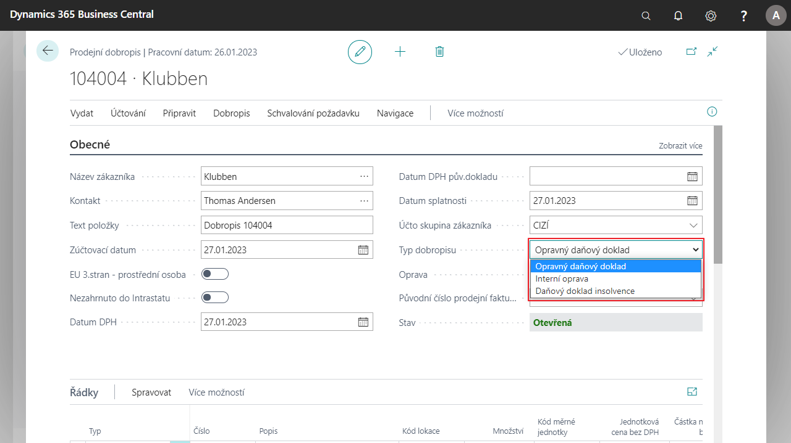

# Opravné prodejní doklady
Funkcionalita umožňuje v hlavičce prodejního dokladu označit typ dobropisu a podle toho ovlivnit tiskovou sestavu.

Podle novelizace Zákona o DPH je nutné rozlišovat typy prodejních dobropisů. Tato funkce umožňuje uživatelům nastavit následující typy dobropisů:

- Opravný daňový doklad
- Interní oprava
- Daňový doklad insolvence

## Výběr typu dobropisu v dokladu
1. Vyberte ikonu , zadejte **Prodejní dobropisy** a poté vyberte související odkaz.
2. Klikněte na **Nový**.
3. Vyberte zákazníka, zúčtovací datum a další potřebné informace.
3. V hlavičce dokladu vyberte v poli **Typ dobropisu** jednu z možností:
    - Opravný daňový doklad
    - Interní oprava
    - Daňový doklad insolvence
4. Poté dále pokračujte ve zpracování dokladu dle potřeby.

## Viz také

[Základní lokalizační balíček pro Česko](ui-extensions-core-localization-pack-cz.md)  
[České lokální funkcionality](czech-local-functionality.md)  
[Finance](../../finance.md)  
