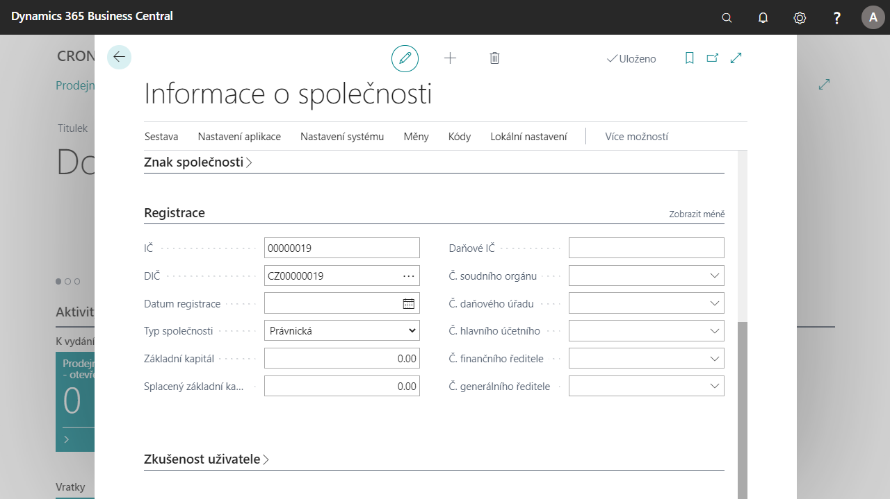

# Statutární informace o společnosti

V současné době kolují mnohé doklady vně i uvnitř společnosti. Místní právní předpisy stanovují minimální požadavky na takové doklady. Tyto požadavky můžeme zhruba rozdělit do tří skupin:

- Jména zástupců společnosti musí být uvedena na některých interních či externích dokladech
- Zápatí dokumentů – většina externích dokumentů musí obsahovat základní informace o společnosti v zápatích dokumentů, obvykle v jazyce partnerské společnosti
- Registrační čísla společnosti musí být viditelně uvedena v interních a externích dokumentech

Tato funkcionalita umožňuje uživatelům definovat zástupce společnosti a nastavit je jako generálního ředitele, hlavního účetního a finančního manažera pro použití v interních a externích dokladech.
Uživatelé mohou definovat zápatí dokumentu v různých jazycích. Tato zápatí lze použít v různých sestavách a dokumentech.

Další registrační čísla společnosti a další registrační informace mohou být uloženy v Informacích o společnosti a používány v dokladech.

## Doplnění informací o společnosti
### Nastavení doplňujících informací o společnosti 
1. Vyberte ikonu , zadejte **Informace o společnosti** a poté vyberte související odkaz.
1. Na kartě Informací o společnosti v záložce **Obecné** vyplňte pole **Hlavní předmět podnikání** a **Kód výchozího bankovního účtu**.
1. Po nastavení polí stránku zavřete.
### Nastavení informací pro statutární vykazování  
1. Vyberte ikonu , zadejte **Nastavení statutárního vykazování** a poté vyberte související odkaz.
1. V Nastavení statutárního vykazování vyplňte pole **Hlavní předmět podnikání** a dále **Registrační informace**.
1. Po nastavení polí kartu zavřete.
### Založení zástupců společnosti
1. Vyberte ikonu , zadejte **Nastavení statutárního vykazování** a poté vyberte související odkaz.
1. V Nastavení statutárního vykazování v záložce **Zástupce** vyberte číselnou řadu v poli **Čísla zástupců společnosti**.
1. Po nastavení číselné řady, vyberte ikonu , zadejte **Zástupci společnosti** a poté vyberte související odkaz.
1. Na přehledu Zástupců společnosti vyberte tlačítko **Nový**.
1. Zadejte informace (Jméno, Příjmení, Funkce, Tel. číslo, Číslo zaměstnance) dle potřeby.
1. Po založení potřebných zástupců přehled zavřete.
### Založení zápatí dokumentů
1. Vyberte ikonu , zadejte **Zápatí dokumentů** a poté vyberte související odkaz.
1. V přehledu Zápatí dokumentů vytvořte nové zápatí pro každou jazykovou mutaci, kterou budete používat.
1. Na novém řádku vyplňte pole **Kód jazyka** jazyk, pro které budete zápatí definovat a dále do pole **Text zápatí** zadejte text, který se bude zobrazovat.
1. Po nastavení zápatí stránku zavřete.

 
## Viz Také

[České lokální funkcionality](czech-local-functionality.md)  
[Statutární výkazy](statutory-statements.md)
[Finance](../../finance.md)
