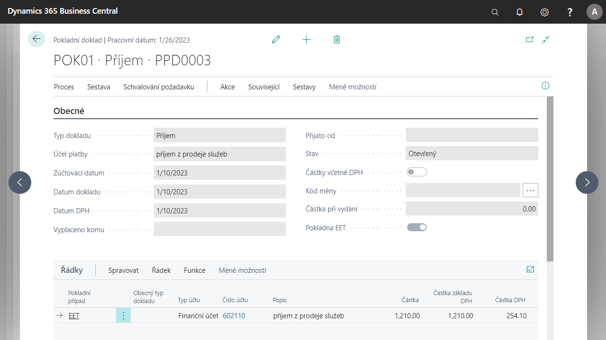

# Pokladny (rozšíření)

V české verzi [!INCLUDE[d365fin](../../includes/d365fin_md.md)] pomáhá funkcionalita pokladen řešit legislativní požadavky a osvědčené postupy v pokladních operacích.

Funkcionalita pokladen a pokladních dokladů umožňuje definovat pokladní účty a pokladny pro fyzický příjem a výdej peněz. Každá pokladna musí mít samostatnou číselnou řadu pokladních dokladů. Pro pokladny je možné nastavit samostatné číselné řady příjmových a výdajových dokladů. Lze předdefinovat různé typy pokladních případů pro zjednodušení zadávání dokladů. Dále je možné nastavit uživatele zodpovědného za pokladnu a tuto zodpovědnost předávat mezi uživateli pokladny.  

## Klíčové funkcionality

- Nastavení pokladen, uživatelé pokladny
- Příjmové a výdajové doklady a jejich účtování
- Pokladní případy používané jako šablony obvyklých účetních případů
- Vyrovnání plateb s položkami zákazníků a dodavatelů
- Vyrovnání plateb se zálohovými fakturami
- Inventarizace pokladny
- Výstupní doklady (Příjmový pokladní doklad, Výdajový pokladní doklad)
- Sestavy (Pokladní kniha, Kniha pokladního účtu a Předání pokladny)

Karta pokladny obsahuje základní údaje o pokladně, jako jsou číslo, měna, kontaktní údaje apod. Dále obsahuje také nastavení pro účtování, definice pro kontroly a limity a přednastavení číselných řad pro pokladní doklady.

Pokladní doklady jsou příjmové nebo výdajové a mohou být v různých měnách dle pokladny. Doklady dále umožňují vydání, účtování a tisk výstupních dokladů.

## Nastavení uživatelů pokladen
1. Vyberte ikonu , zadejte **Nastavení pokladen** a poté vyberte související odkaz.
2. Na stránce **Nastavení pokladen** v záložce **Navigace** použijte funkci **Uživatelé pokladny**.
3. Otevře se karta Uživatelů pokladen. Pro založení nového uživatele použijte funkci **Nový**.
4. V řádku vyberte **Číslo pokladny**, na které bude uživatel pracovat. Dále vyberte **ID uživatele** a vyberte, zda bude uživatel mít možnost **Vydat**, **Účtovat** nebo **Účtovat pouze EET**.
5. Po nastavení stránku zavřete.

## Nastavení číselných řad pro příjmové a výdajové doklady
1. Vyberte ikonu , zadejte **Nastavení pokladen** a poté vyberte související odkaz.
2. Otevřete kartu vybrané pokladny.
3. Na **Kartě nastavení pokladny** naleznete v záložce **Číslování**.
4. V polích **Číslo příjmových pokladních dokladů** a **Číslo výdajových pokladních dokladů** vyberte číselnou řadu, kterou chcete použít.
5. Po nastavení kartu nastavení pokladny zavřete.
## Nastavení pokladních případů
1. Vyberte ikonu , zadejte **Nastavení pokladních případů** a poté vyberte související odkaz.
2. Na přehledu **Pokladních případů** založte případ pomocí funkce **Nový**.
3. Vyplňte následující pole dle Vaší potřeby:
    - Kód, popis
    - Typ pokladního dokladu (příjem nebo výdej)
    - Typ účtu, číslo účtu, typ obecného účtování, Účto skupiny
    - Kód globální dimenze 1 a Kód globální dimenze 2 a případně, zda se jedná o transakci EET
4. Po nastavení přehled zavřete.

## Inventarizace pokladny
Pro účely inventarizace pokladen v Business Central naleznete sestavu pro vygenerování zůstatku v pokladně.
### Nastavení nominální hodnoty
Nejdříve je nutné vydefinovat, jaké bankovky a mince používáte v různých měnách. Je nezbytné vydefinovat jejich nominální hodnotu pro každou měnu.
1. Vyberte ikonu , zadejte **Nominální hodnoty měn** a poté vyberte související odkaz.
2. V tabulce zakládejte řádky v kombinaci **Kód měny** a **Hodnota**. Pro nastavení lokální měny systému nevybírejte kód měny.
3. Po vydefinování řádků stránku můžete zavřít.

### Sestava Inventarizace pokladny
1. Vyberte ikonu , zadejte **Inventarizace pokladny** a poté vyberte související odkaz.
2. Na stránce před spuštěním sestavy vyberte vstupní parametry, jako jsou:
    - **Kód pokladny**, pro kterou se inventura provádí.
    - **Datum**, kdy se inventura provádí.
    - Možnost **Zobrazit účetní stav** pokladny v sestavě.
    - Dále na stránce vyplňte tabulku **Nominální hodnoty**, tedy počty jednotlivých bankovek a mincí.
3. Po nastavení filtrů použijte tlačíko **Náhled a zavřít**. Poté se Vám zobrazí stránka, kde uvidíte stav vybrané pokladny.

## Vyrovnání položek zákazníka nebo dodavatele

Z řádků pokladního dokladu lze spustit funkci Vyrovnat položky, která umožňuje vybrat k vyrovnání položky zákazníků nebo dodavatelů. Obdobně jsou k dispozici funkce pro vyrovnání se zálohovými fakturami.

1. Vyberte ikonu , zadejte **Pokladní doklady** a poté vyberte související odkaz.
2. V přehledu **pokladních dokladů** vytvořte pokladní doklad pomocí tlačítka **Nový**.
3. Na kartě pokladního dokladu vyplňte pole:
    - Typ dokladu: Příjem nebo Výdej
    - Účel platby: Vypište text, který určuje účel platby
    - Zúčtovací datum, Datum dokladu a DPH
    - Případně ostatní pole dle potřeby
4.  V řádcích vyberte:
    - Typ účtu: Zákazník nebo Dodavatel
    - Číslo účtu: Vyberte číslo zákazníka nebo dodavatele
    - Ve funkcích nad řádkem použijte funkci **Vyrovnat položky** a najděte položku, kterou chcete vyrovnat.
5. Po vybrání položky můžete doklad zaúčtovat.

## Viz také

[Česká lokální funkcionalita](czech-local-functionality.md)  
[Finance](../../finance.md)
