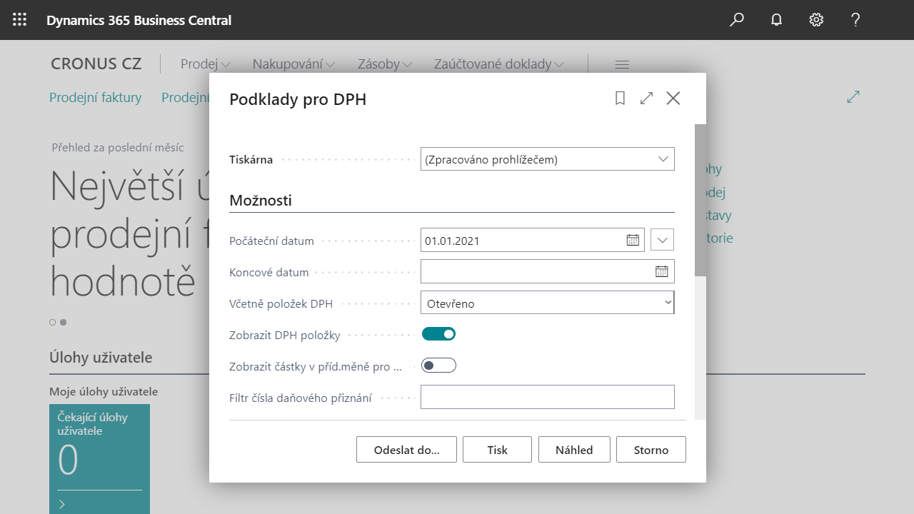

# Sestavy DPH

Pro splnění nároků na tiskové výstupy pro DPH odpovídající legislativním požadavkům a místním zvyklostem jsou k dispozici následující sestavy:  

- Výpočet a účtování vyrovnání DPH - přizpůsobení standartní sestavy
- Podklady pro DPH
- Seznam daňových dokladů
- Přehled DPH na prodejních zálohách
- Přehled DPH na nákupních zálohách

## DPH Reporty
### Podklad DPH
Report, který tiskne přehled všech zaúčtovaných dokladů za vybrané období v třídění podle jednotlivých kombinací DPH účto skupin. Report je možné tisknout s přehledem jednotlivých dokladů (položek DPH) nebo sumárně v částkách za jednotlivé kombinace. Reprot slouží jako podklad ke kontrole na účetnictví.  

### Seznam daňových dokladů
Report, kterým lze vytisknout přehledně základ a částku DPH u jednotlivých daňových dokladů za určité období. Report lze tisknout buď sumárně podle typu daně a sazby daně nebo s rozpadem na jednotlivé doklady v dělení jen nákup, jen prodej či obojí.  

### Fin. Odsouhlasení DPH
Report, který tiskne rozpad jednotlivých řádků výkazu DPH dle finančních účtů.   

## Spuštění sestvy Podlady pro DPH

Náhled účtovaných položek za dané období.

1. Vyberte ikonu , zadejte **Podklady pro DPH** a poté vyberte související odkaz.
2. V záložce **Možnosti** zadejte do pole **Počáteční datum** hodnotu prvního data pro období zaúčtovaného dokladu pro položky DPH.
3. V poli **Včetně položek DPH** vyberte hodnotu **Otevřeno**.
4. Vyberte možnost **Zobrazit DPH položky**.
5. Spustě sestavu pomocí tlačítka **Náhled**.
6. V zobrazené sestavě jsou uvedeny nákupní faktura účtovaná v daném období, dle nastavení.
7. V tiskové sestavě Podklad pro DPH jsou položky filtrovány dle data DPH a obsahují informace jako kód země, DIČ partnera, základ a částka DPH. 

## Viz Také

[Základní lokalizační balíček pro Česko](ui-extensions-core-localization-pack-cz.md)  
[České lokální funkcionality](czech-local-functionality.md)  
[Kontrolní hlášení DPH](how-to-create-vat-control-report.md)  
[Datum DPH](how-to-setup-vat-date.md)  
[Výkaz DPH](vat-statement.md)  
[Finance](../../finance.md)  
