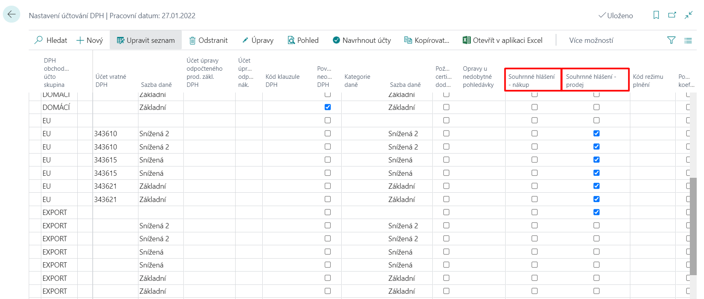
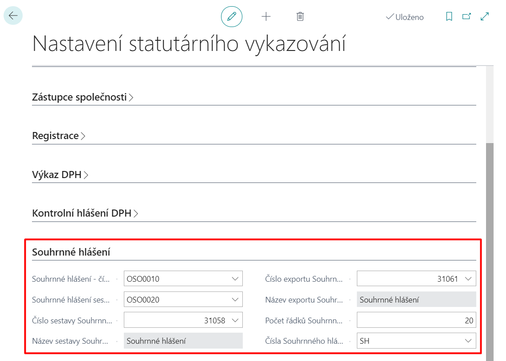

# Souhrnné hlášení

Souhrnné hlášení je používáno k hlášením o prodejích daňovým orgánům v zemích EU (Evropské unie). Podle § 102 zákona o DPH 235/2004 je plátce povinen podat Souhrnné hlášení. Souhrnné hlášení musí být podáno elektronicky na finanční úřad.  

Funkcionalita Souhrnného hlášení umožňuje:

- Nastavit stat. vykazování s obecným nastavením pro hlášení.
- Vybrat kombinace DPH obchodní účto skupiny a DPH účto skupiny zboží (nastavení účtování DPH) pro zahrnutí do souhrnného hlášení.
- Uchovat historii souhrnných hlášení.
- Zadat všechny informace potřebné pro elektronické podání souboru.
- Navrhnout řádky pro souhrnné hlášení.
- Podporovat opravná hlášení.
- Exportovat data do souboru pro elektronické podání.
 
## Nastavení
Pro potřeby této funkcionality byly upraveny následující stránky:

### Nastavení účtování DPH

1. Pomocí vyhledávací funkce ") vyhledejte **Nastavení účtování DPH**.
2. Na této přehledové tabulce jsou přidány pole **Souhrnné hlášení - nákup** a **Souhrnné hlášení - prodej**.
3. Tato pole je třeba nastavit (zaškrtnout) pro nastavení účtování, které chcete zahrnout do souhrnného hlášení pro prodej/nákup.
4. Po spránvém nastavení můžete stránku zavřít.

> [!NOTE]
> Tyto pole jsou přidány i na stránce **Karta nastavení účto DPH**. Tato pole můžete proto zaškrtnout na stránce **Nastavení účtování DPH** nebo na stránce **Karta nastavení účto DPH** (pokud tyto pole zaškrtnete na jedné stránce, automaticky se zaškrtnou i na druhé).  
> Pokud chcete projít na stránku **Karta nastavení účto DPH**, na stránce **Nastavení účtování DPH** klikněte na řádek, pro který chcete tuto stránku zobrazit a klikněte na funkci **Úpravy**.

### Nastavení statutárního vykazování

1. Pomocí vyhledávací funkce ") vyhledejte **Nastavení statutárního vykazování**.
2. V této tabulce nastavení je přidána záložka **Souhrnné hlášení** kde je potřeba nastavit příslušná pole:
    - **Souhrnné hlášení - číslo zaměstnance oprávněné osoby** - Určuje oprávněného zaměstnance pro souhrnné hlášení.
    - **Souhrnné hlášení sestavil - číslo zaměstnance** - Určuje zaměstnance, který souhrnné hlášení sestavil.
    - **Číslo sestavy Souhrnného hlášení**  - Určuje číslo objektu pro výkaz Souhrnného hlášení.
    - **Název sestavy Souhrnného hlášení** - Určuje název objektu pro výkaz Souhrnné hlášení.
    - **Číslo exportu Souhrnného hlášení** - Určuje číslo objektu pro export Souhrnného hlášení.
    - **Název exportu Souhrnného hlášení** - Určuje název objektu pro export Souhrnného hlášení.
    - **Počet řádků Souhrnného hlášení** - Určuje počet řádků Souhrnného hlášení.
    - **Čísla Souhrnného hlášení**  - Určuje číselnou řadu pro Souhrnné hlášení.

1. Po spránvém nastavení můžete stránku zavřít.

## Použití

Pokud správně nastavíte všechny potřebné body z nastavení pro souhrnné hlášení (vytvoříte a zaúčtujete například prodejní fakturu na zboží nebo služby dodané do EU) při vytvoření souhrnného hlášení se tyto hodnoty do hlášení zahrnou.

1. Pomocí vyhledávací funkce ") vyhledejte **Souhrnná hlášení**.
2. Pro vytvoření nového souhrnného hlášení klikněte na stránce **Souhrnná hlášení** na funkci **Nový**.
3. Na stránce **Souhrnná hlášení** vyplňte pole v hlavičce podle potřeby.
4. Pokud chcete systémem navrhnout řádky pro zadané období souhrnného hlášení klikněte na dávkovou úlohu **Proces -> Návrh řádků...**
5. Pokud chcete získat řádky pro opravné souhrnného hlášení klikněte na dávkovou úlohu **Proces -> Získat řádky pro opravu...**
6. Pokud jsou řádky souhrnného hlášení zadány správně, musíte doklad vydat. Když je doklad vydán, bude možno hlášení vytisknout nebo exportovat. To provedete pomocí funkce **Proces -> Vydat**.
7. Pro export souhrnného hlášení klikněte na funkci **Proces -> Exportovat**. Tato dávková úloha exportuje výsledky souhrnného hlášení do formátu XML.

> [!NOTE]
> Funkce **Sestavy -> Testovací sestava** zobrazí testovací sestavu souhrnného hlášení, takže můžete nalézt a opravit chyby před vydáním nebo exportem dokladu.

## Viz Také

[Základní lokalizační balíček pro Česko](ui-extensions-core-localization-pack-cz.md)  
[České lokální funkcionality](czech-local-functionality.md)  
[Finance](../../finance.md)  
