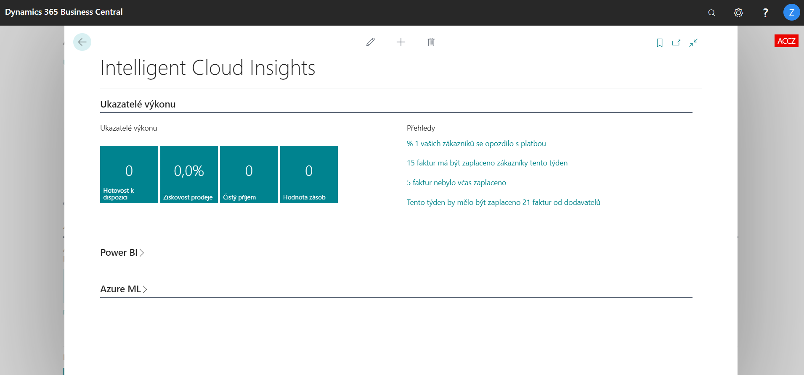

# Váš přístup k inteligentnímu Cloudu s Business Central [!INCLUDE[prodshort](includes/prodshort.md)]

Jako uživatel [!INCLUDE[prodshort](includes/prodshort.md)] online máte plný přístup ke scénářům založeným na inteligentním cloudu, jako jsou KPI založené na strojovém učení nebo při prohlížení dat v Power BI. Nicméně, zatímco [!INCLUDE[prodshort](includes/prodshort.md)] je primárně cloudově orientovaná služba , také zákazníci, kteří potřebují plně pracovat lokálně (on-premises) nebo na "Inteligent Edge" připojeném ke cloudu, to mohou dělat také.

Máte-li zájem o [!INCLUDE[prodshort](includes/prodshort.md)], můžete se přihlásit k bezplatné zkušební verzi online, nebo se můžete rozhodnout pro spolupráci s partnerem pro nasazení produktu [!INCLUDE[prodshort](includes/prodshort.md)] lokálně na hardwaru dle vlastního výběru. Poté se můžete rozhodnout pro získání inteligentních přehledů připojením ke cloudu. V důsledku toho budou data z vašeho lokálně nasazeného [!INCLUDE[prodshort](includes/prodshort.md)] replikována do cloudu pro inteligentní cloudové scénáře.

Připojení k inteligentním cloudu z on-premises řešení  vyžaduje specifikaci informací o Vaší databázi Vaším  správcem. Pro další informace navštivte [Připojení k inteligentnímu cloudu](/dynamics365/business-central/dev-itpro/administration/about-intelligent-edge) v obsahu pro IT odborníky [!INCLUDE[prodshort](includes/prodshort.md)].

## Prohlížení inteligentních cloudových statistik v [!INCLUDE[prodshort](includes/prodshort.md)] online

Ve vaší online společnosti [!INCLUDE[prodshort](includes/prodshort.md)]  zobrazuje stránka **Intelligent Cloud Insights** čtyři klíčové ukazatele pro většinu podniků:

- Hotovost k dispozici
- Ziskovost prodeje
- Čistý zisk
- Hodnota zásob

Vedle ukazatelů výkonu získáte přehled o potenciálních oblastech zájmu, včetně plateb po splatnosti. Zvolte si přehled, který vám umožní zkoumat data.

> [!div class="mx-imgBorder"]
> 

Stránka se také připojuje k Power BI pro ještě více přehledů.

## Zobrazení On-Premises Intelligent Insights

Když váš obchodní partner Dynamics 365 získal správnou licenci pro vaše místní (on-premises) řešení pro připojení ke cloudu prostřednictvím [!INCLUDE[prodshort](includes/prodshort.md)], může správce připojení nastavit. Jakmile je toto provedeno, můžete zobrazit stejné přehledy z cloudu ve vaší on-premises aplikaci. V závislosti na on-premises řešení lze stránku **Intelligent Cloud Insights** vložit na domovskou stránku nebo na samostatnou stránku jak v [!INCLUDE[prodshort](includes/prodshort.md)] online tak i on-premises.

## Připojení k Business Central z jiných produktů Dynamics

Pokud používáte některou z podporovaných on-premises verzí, můžete se také připojit k [!INCLUDE[prodshort](includes/prodshort.md)] online a získat inteligentní přehledy přímo lokálně. Pro další informace navštivte [Připojení k inteligentnímu cloudu](/dynamics365/business-central/dev-itpro/administration/about-intelligent-edge) v obsahu pro IT odborníky [!INCLUDE[prodshort](includes/prodshort.md)].

## Viz také

[Vítejte v Business Central](index.md)  
[Rozšíření Business Central Intelligent Cloud](ui-extensions-intelligent-cloud.md)  
[Rozšíření pro replikaci dat](ui-extensions-data-replication.md)  
[Připojení k inteligentnímu cloudu](/dynamics365/business-central/dev-itpro/administration/about-intelligent-edge)
